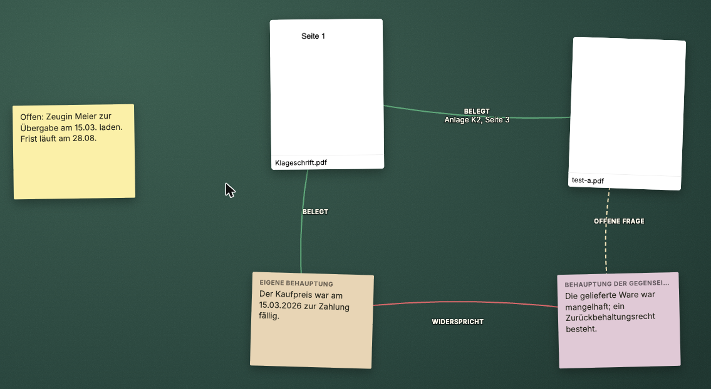
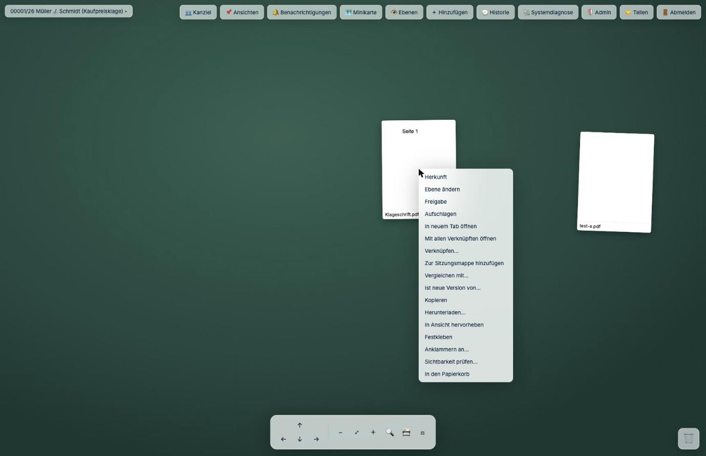

# J-DESK

[](https://github.com/PBaumfalk/j-desk/actions/workflows/ci.yml)
[](LICENSE)
[](https://ghcr.io/pbaumfalk/j-desk)
[](#für-entwickler)

**Der digitale Schreibtisch für juristische Arbeit.** Breiten Sie die Dokumente einer
Akte nebeneinander aus, verknüpfen Sie jede Behauptung mit der Fundstelle, die sie
belegt, und sehen Sie auf einen Blick, was trägt, was bestritten ist und was noch offen
ist. Ihre Akten bleiben dabei in j-lawyer — und was Sie intern notieren, bleibt intern.

> **English abstract** — Visual case-work surface for German legal practice: spread out
> the documents of a case file on an unbounded canvas, link assertions to the exact
> evidence supporting them (eleven typed relations, thirteen legal object types), query
> the file for gaps ("facts without evidence"), and keep internal annotations provably
> out of exports — redaction removes text from the PDF rather than covering it.
> Integrates with [j-lawyer](https://www.j-lawyer.org/) as the system of record.
> Self-hosted (Node + SQLite), Docker image provided. UI and documentation are in German.



---

## Kennen Sie das?

Die Akte hat 400 Seiten. Der Schriftsatz der Gegenseite behauptet auf Seite 12 etwas,
das dem Vertrag auf Seite 213 widerspricht. Das E-Mail-Protokoll auf Seite 88 stützt
Ihre Version — aber nur zusammen mit der Rechnung auf Seite 301.

Am Bildschirm sehen Sie immer nur **ein** Dokument. Also drucken Sie aus, legen Papier
auf den Tisch, kleben Zettel daran, ziehen Linien mit dem Bleistift. Das funktioniert
gut. Bis der Tisch zu klein wird. Bis Sie den Stapel für den Termin wegräumen müssen.
Bis die Kollegin das Mandat übernimmt und vor einem Berg Papier steht, dem man nicht
ansieht, was schon geprüft wurde.

Und dann kommt die Frage des Gerichts nach dem Beweisangebot zu einer Behauptung, die
Sie vor drei Wochen aufgestellt haben. War da was? Wo stand das noch?

## Die eine Frage

J-DESK ist darauf gebaut, jederzeit eine Frage beantworten zu können:

> **Welche Behauptung wird durch welche konkrete Fundstelle belegt, welche Gegenposition
> besteht, was ist noch offen — und welches verwertbare Arbeitsergebnis entsteht daraus?**

Ein Schriftsatz ist nur so gut wie die Antwort darauf. Alles Weitere in diesem Dokument
dient dieser einen Frage.

---

# Was J-DESK für Sie tut

## 1. Die Akte ausbreiten — endlich Platz

Ein Tisch, der nie zu klein wird. Legen Sie so viele Dokumente nebeneinander, wie die
Sache braucht.

- **Karten frei anordnen** — anfassen, schieben, drehen wie Papier
- **Stapeln** — was zusammengehört, liegt aufeinander; einzelne Blätter wieder herausziehen
- **Aufschlagen** — Doppelklick, und Sie lesen im Dokument; mehrere gleichzeitig nebeneinander
- **Ausschnitte herauslösen** — wenn nur ein Absatz auf Seite 213 zählt, schneiden Sie ihn
  heraus und legen ihn auf den Tisch. Der Weg zum Original bleibt erhalten
- **Externe Inhalte aufnehmen** — Weblinks, Urteile, Normen, E-Mails, Fotos, Audio, Video,
  Textfragmente. Entweder in j-lawyer abgelegt oder klar als externe Referenz markiert
- **Orientierung behalten** — Minikarte, benannte Arbeitszonen, „zurück zur letzten
  Position", Verlauf, Brotkrumen in Konvoluten

## 2. Behauptung und Beweis verknüpfen — der Kern

Sie ziehen eine Linie von einer Behauptung zu dem, was sie belegt. Und Sie sagen dazu,
**worin** die Beziehung besteht.

**Elf Beziehungsarten**, nach Familien eingefärbt:

| Bestätigend (grün) | Widersprechend (rot) | Offen (gestrichelt) |
|---|---|---|
| belegt · bestätigt · gehört zu · Folge von · Voraussetzung für · unstreitig | widerspricht · widerlegt · entkräftet · streitig | offene Frage |

**Dreizehn juristische Objekttypen** — nicht bloß „Notizen", sondern das, womit Sie
tatsächlich arbeiten:

Tatsache · eigene Behauptung · Behauptung der Gegenseite · Beweismittel · Gegenbeweis ·
Rechtsfrage · Tatbestandsmerkmal · Einwendung · Risiko · Frist · Aufgabe ·
zitierfähige Fundstelle · Ergebnis

Nach einer halben Stunde Arbeit sehen Sie ohne Nachdenken: Grüne Linien sind Ihr
Fundament. Rote sind die Streitpunkte. Gestrichelte sind Ihre Hausaufgaben.

## 3. Der Akte Fragen stellen — Lücken finden, bevor das Gericht sie findet

Das ist der Punkt, an dem Papier nicht mehr mithält. J-DESK wertet die Struktur aus und
beantwortet auf Knopfdruck:

- **„Welche Tatsachen habe ich ohne Beweismittel?"** — die Lücken in Ihrem Vortrag
- **„Welche Behauptungen der Gegenseite habe ich noch nicht erwidert?"** — was Sie sonst
  als zugestanden riskieren
- **„Welche Beweismittel stützen mehrere Tatsachen?"** — wo ein Zeuge besonders wichtig wird

Jede Antwort ist anklickbar und führt Sie direkt zur Stelle auf dem Tisch.

## 4. Jede Fundstelle bleibt auffindbar — dauerhaft

Jedes Objekt, das Sie anlegen, trägt seine Herkunft mit sich: **Dokument, Version, Seite,
Position, wer es angelegt hat, wann.**

Von jedem Objekt springen Sie zur Originalstelle — der Viewer öffnet das Dokument an
genau der richtigen Stelle, hervorgehoben. Auch nach Verschieben, nach einer neuen
Dokumentversion, nach Neustart, nach Export.

Beim Ausschneiden wird der Text zusätzlich als Momentaufnahme gesichert. Ändert sich das
Quelldokument, sehen Sie noch, was dort stand, als Sie es zitiert haben.

Und bei Altbeständen ohne diese Angaben steht ehrlich **„Herkunft unbekannt"** statt
einer erfundenen Angabe.

## 5. Chronologie — wann geschah was

Ziehen Sie Objekte in eine Zeitleiste: Ereignis, Dokument, E-Mail, Bescheid, Frist,
Zahlung, Zeugenaussage.

Juristisch entscheidend: **Zeitangaben dürfen unsicher sein.** „ungefähr", „Zeitraum",
„streitig", „aus dem Dokument abgeleitet" — die Zeitleiste stellt das entsprechend dar,
statt Sie zu einer Genauigkeit zu zwingen, die die Akte nicht hergibt.

## 6. Fassungen vergleichen

- **Synchronsicht** — zwei Dokumente nebeneinander, Scrollen und Seitenwechsel gekoppelt
- **Textunterschiede** markiert — was wurde geändert zwischen Entwurf und Endfassung?
- **Versionsketten** — „B ist neue Version von A", nachvollziehbar über beliebig viele
  Stufen, mit Richtungspfeil auf dem Tisch

## 7. Suchen und finden — auch in Scans

Eine Suche über **alles**: Dokumenttitel, PDF-Inhalt, OCR-Text, Ihre Annotationen,
Notizzettel, Stempeltexte, Ausschnitte, Verknüpfungsarten, Ersteller, Datum.

- **Gescannte Dokumente werden per OCR (deutsch) durchsuchbar** — und die Erkennungs­qualität
  ist erkennbar, damit Sie wissen, worauf Sie sich verlassen können
- **Treffer erscheinen auf dem Tisch**, nicht nur als Liste: die betroffenen Karten und
  Seiten leuchten auf
- **Treffer respektieren Berechtigungen** — niemand findet über die Suche etwas, das er
  nicht sehen darf

## 8. Anlagenpaket bauen — in Minuten statt Stunden

Dokumente auswählen, Reihenfolge festlegen (auch direkt aus der Anordnung auf dem Tisch),
fertig. J-DESK erzeugt:

- **Deckblatt**
- **Anlagennummern** (K1, K2, …)
- **durchgehende Seitennummerierung**
- **Inhaltsverzeichnis**
- **PDF-Lesezeichen**

Dubletten werden erkannt, leere Seiten auf Wunsch entfernt. **Die Originale bleiben
unangetastet.**

## 9. Schwärzen, das wirklich schwärzt

Eine Schwärzung, die den Text nur schwarz übermalt, ist keine Schwärzung — der Text steht
weiter in der Datei und lässt sich mit Kopieren-und-Einfügen sichtbar machen. Genau dieser
Fehler hat schon Kanzleien und Behörden Schlagzeilen eingebracht.

**J-DESK entfernt den Text aus der PDF-Datei.** Nicht überdeckt — gelöscht. Dazu zwei
Sicherungen:

- **Im Zweifel wird mehr gelöscht, nicht weniger.** Zu viel Gelöschtes sehen Sie sofort;
  übrig gebliebener Text wäre der gefährliche Fall
- **Es wird nachgeprüft.** Nach dem Schwärzen liest das Programm die erzeugte Datei erneut
  und sucht nach Text, der verschwunden sein müsste. Findet es welchen, **bricht der Export
  ab**, statt Ihnen eine unsichere Datei zu geben

Bei ungewöhnlich aufgebauten Dateien — etwa gedrehten Seiten — verweigert J-DESK die
Bearbeitung, statt heimlich an der falschen Stelle zu schwärzen.

## 10. Was intern ist, bleibt intern

Ihre Bewertungen, Zwischenstände und Notizen („Zeuge unglaubwürdig", „hier hakt es")
gehören nicht in den Schriftsatz an die Gegenseite.


**Drei Freigabestufen:** *intern* (nie im Export) · *mandant* (für Mandantengäste
sichtbar, nicht im Export) · *export* (darf hinaus).

Entscheidend ist die Voreinstellung: **Was nicht ausdrücklich freigegeben ist, gilt als
intern.** Nicht umgekehrt. So steht es auch im Quelltext begründet:

> Ein Irrtum in Export-Richtung kostet Vertraulichkeit, ein Irrtum in intern-Richtung nur
> eine fehlende Seite im Artefakt. **Vertraulichkeit schlägt Vollständigkeit.**

Dazu **Ebenen** (privat, Kanzlei, KI-Vorschläge, exportierbar) mit eigener
Bearbeitungsberechtigung und Exportfreigabe, sowie **fünf Rollen** je Schreibtisch:
Eigentümer, Bearbeiter, Kommentator, Nur-Lesen, externer Gast.

Und technisch belastbar: **Der Server liefert jedem nur das, was er sehen darf** — für
Web, Echtzeitverbindung, Export, Suche und KI-Anbindung gleichermaßen. Nicht die
Oberfläche blendet aus; der Server gibt es gar nicht erst heraus. Das ist per
Netzwerk-Mitschnitt getestet.

## 11. Zu zweit an derselben Akte

- **Sie sehen, wer gerade mitarbeitet** und welches Objekt jemand bearbeitet
- **Kurze Sperren** verhindern, dass zwei dieselbe Sache gleichzeitig ändern
- **Bei einem echten Konflikt fragt J-DESK nach** — gerade bei Fristen und Status wird nie
  still zusammengeführt. Sie entscheiden, welche Fassung gilt
- **Offline weiterarbeiten** — Änderungen werden gepuffert und nach Wiederverbindung
  sauber nachgespielt

## 12. Der Termin — Sitzungsmodus

Vor Gericht ist ein Laptop mit Mauszeiger unbrauchbar. Deshalb ein eigener Modus:

- **Große Bedienziele**, Vollbild, **Verschiebe-Sperre** — nichts verrutscht beim Antippen
- **Sitzungsmappe vorab vorbereiten**: Dokumente, Fundstellen, offene Fragen
- **Im Termin**: Schnellzugriff, Sprungmarken, Dokumente per Fingertipp nebeneinander
- **Sitzungsnotizen** und Zwischenspeicherung, auch ohne Netz

## 13. Unterwegs

- **iPad**: Lesen, Markieren, Ordnen, Sitzungsmodus, Pencil-Eingabe
- **Smartphone**: Schnellzugriff, Fotografieren und Hochladen, Diktat, Aufgaben abhaken —
  **bewusst keine volle Oberfläche**, weil ein Schreibtisch auf 6 Zoll niemandem hilft

## 14. Diktieren

Notizen, Gedanken und Aufgaben sprechen statt tippen. Die Aufnahme läuft über den eigenen
Server zur Transkription und wird **nirgends abgelegt**.

Wichtig für die Verschwiegenheit: Der frühere Weg über die Spracherkennung des Browsers
schickte Ton an dessen Hersteller. Dieser Weg wurde **strukturell entfernt** und ist per
Wächtertest dagegen gesichert, dass er zurückkehrt.

## 15. Aufgaben und Fristen

Aufgaben mit **Verantwortlichem, Fälligkeit, Priorität, Status** und Bezug zu Dokument
oder Fundstelle — direkt an der Stelle, an der die Arbeit anfällt.

**Übergabe an j-lawyer**: Was dort als Frist oder Aufgabe geführt gehört, wandert dorthin.

## 16. Rechnen in der Akte

Tabellenkarten mit einfachen Formeln: Summen, Datumsdifferenzen, Zinsen, wiederkehrende
Zahlungen. **Zeilen sind mit Belegen verknüpfbar** — jede Zahl bleibt auf ihre Fundstelle
zurückführbar.

## 17. KI — mit Leine

KI kann helfen, Fundstellen zu finden. Sie darf aber nicht unbemerkt in der Akte
herumräumen. Deshalb eine Vertrauensschicht:

- **Vorher fragen**: Schreibende KI-Aktionen zeigen an, was sie tun wollen, und laufen erst
  nach Ihrer Freigabe — alles übernehmen, einzeln, oder ablehnen
- **Immer zurücknehmbar** und in der Historie sichtbar. Die KI ordnet **niemals unsichtbar**
  Ihren Schreibtisch um
- **Quellenpflicht**: Jede KI-Ausgabe nennt Quelle, Seite und genaue Textstelle
- **Vorschlag bleibt Vorschlag**: Ergebnisse entstehen auf einer eigenen Ebene und werden
  erst nach Ihrer Bestätigung zu regulären Objekten

Angebunden über MCP, damit Ihr KI-Werkzeug mit der Akte arbeiten kann — unter denselben
Berechtigungsprüfungen wie ein Browser-Zugriff.

## 18. Nichts geht verloren

- **Automatisches Speichern**, permanent. Nach einem Absturz ist der Stand da
- **Historie**: wer wann was erstellt, geändert, gelöscht oder verbunden hat — einschließlich
  KI-Aktionen und Exporten, mit Genehmiger
- **Früheren Stand wiederherstellen** — und die Wiederherstellung ist selbst wieder ein
  protokollierter Vorgang
- **Papierkorb und Schredder sind getrennt**: vom Tisch entfernen · wiederherstellbar löschen ·
  endgültig löschen — mit dem klaren Hinweis, dass **in j-lawyer nichts gelöscht wird**
- **Ganzer Schreibtisch als Paket** exportier- und importierbar — und automatisch in die
  j-lawyer-Akte gesichert. Der Arbeitsstand reist mit der Akte

## 19. j-lawyer bleibt der Chef

J-DESK legt **keine zweite Aktenablage** an. Kein Schatten-Dokumentenmanagement.

Karten zeigen ehrlich den Zustand ihres Quelldokuments: existiert · ersetzt · umbenannt ·
nicht erreichbar · gelöscht · Berechtigung entzogen · archiviert.

Ist ein Quelldokument gerade nicht verfügbar, **bleiben Ihre Annotationen erhalten** und
der Zustand wird erklärt, statt kommentarlos etwas verschwinden zu lassen. Und J-DESK
prüft die j-lawyer-Version auf Verträglichkeit, statt an einer zu neuen oder zu alten
Installation stillschweigend zu scheitern.

## 20. Für die, die es betreiben müssen

- **Installationsassistent** und dokumentierter Update-Ablauf samt Datenbank-Migrationen
- **Systemdiagnose**: Verbindungen, Speicher, Sicherungsstand, verständliche Fehlerberichte
- **„Warum sieht Frau Meier dieses Dokument nicht?"** — ohne SQL beantwortbar, direkt in
  der Oberfläche
- **Lasttest mit realistisch großer Akte** bestanden (hunderte Dokumente und Objekte)
- **Gesicherte Wiederherstellung**: Die Sicherungsanleitung wird bei **jedem Testlauf**
  gegen das echte Programmverhalten geprüft. Weicht sie ab, schlägt ein Test fehl

---

## Und der Alltag?

Kleinigkeiten, die den Unterschied machen:

- **Schreibtisch aufräumen** arbeitet **immer als Vorschau** — ausrichten, sortieren,
  gruppieren, Dubletten und unverbundene Notizen finden. Nie als überraschende
  Vollautomatik
- **Ansichten speichern**: „Nur was den Verzug betrifft" — mit Position, Zoom, sichtbaren
  Ebenen, Filtern und geöffneten Dokumenten. Jederzeit zurückkehren
- **Vorlagen für Mandatstypen**: Kündigungsschutz, Strafverfahren, Vertragsprüfung — mit
  vorbereiteten Bereichen und Objekttypen
- **Befehlspalette und Tastenkürzel** für alles Wichtige
- **Benachrichtigungen nur für Relevantes**: Erwähnungen, Aufgabenänderungen, ersetzte
  Dokumente, wartende KI-Freigaben, verlorene Quellen — **nicht** jede Kartenbewegung



---

## 📖 Handbuch

Vollständige Dokumentation, getrennt nach Zielgruppe und für Nicht-Techniker
verständlich — im **[Handbuch](docs/handbuch/README.md)**:

| Für Anwältinnen und Anwälte | Für die Technikbetreuung |
|---|---|
| [Was ist J-DESK?](docs/handbuch/anwender/was-ist-j-desk.md) | [Installation](docs/handbuch/technik/installation.md) |
| [Der erste Schreibtisch](docs/handbuch/anwender/erster-schreibtisch.md) | [Betrieb, Sicherung, Update](docs/handbuch/technik/betrieb.md) |
| [Vertraulichkeit](docs/handbuch/anwender/vertraulichkeit.md) | [Störungssuche](docs/handbuch/technik/stoerungssuche.md) |

## Installation

<details>
<summary><strong>🖥️ Auf einem Server mit Docker</strong> (empfohlen — eine Adresse für die ganze Kanzlei)</summary>

```bash
sudo mkdir -p /opt/j-desk && cd /opt/j-desk
curl -fsSLO https://raw.githubusercontent.com/PBaumfalk/j-desk/main/install/compose.yaml
curl -fsSL https://raw.githubusercontent.com/PBaumfalk/j-desk/main/install/.env.beispiel -o .env
nano .env          # JLAWYER_URL eintragen
sudo docker compose up -d
```

Danach `http://<server>:4810` im Browser. Es wird ein fertiges Abbild geladen — Sie
brauchen weder Node noch eine Entwicklungsumgebung auf dem Server.

Die drei häufigsten Stolpersteine beim Eintragen von `JLAWYER_URL`: Das `/j-lawyer-io` am
Ende gehört dazu; `localhost` funktioniert im Container nicht (dort heißt es
`host.docker.internal`); und die Portnummer ist die von j-lawyer, nicht die von J-DESK.

Ausführlich: [Handbuch, Installation](docs/handbuch/technik/installation.md).
</details>

<details>
<summary><strong>🐧 Auf einem Linux-Server ohne Docker</strong> (systemd-Dienst)</summary>

```bash
curl -fsSLO https://raw.githubusercontent.com/PBaumfalk/j-desk/main/install/j-desk-installieren.sh
sudo bash j-desk-installieren.sh
```

Richtet Node 22, einen eigenen Dienstbenutzer ohne Anmelderecht, das Datenverzeichnis
unter `/var/lib/j-desk` und einen systemd-Dienst ein. Das Skript fragt vor jedem
verändernden Schritt nach.

Einstellungen danach in `/etc/j-desk.env`, dann `sudo systemctl restart j-desk`.
</details>

<details>
<summary><strong>🧪 Nur ausprobieren</strong> (mit einem Test-j-lawyer, ohne Ihre echten Daten anzufassen)</summary>

```bash
git clone https://github.com/PBaumfalk/j-desk.git && cd j-desk
docker compose -p jl-docker -f docs/deployment/jlawyer-test-compose.yaml up -d
npm install && npm run build
JLAWYER_URL=http://localhost:8000/j-lawyer-io npm run server
```

Der Test-j-lawyer läuft auf Port 8000 (Anmeldung `admin` / `a`), J-DESK auf 4810.
Nur zum Ausprobieren — die Zugangsdaten sind allgemein bekannt.
</details>

**Systemvoraussetzungen:** 2 GB Arbeitsspeicher und 2 Prozessorkerne genügen; 4 GB sind
angenehmer. Für die zusätzliche Office-Vorschau kommen 4 GB und 2 Kerne obendrauf — die
ist freiwillig, J-DESK arbeitet ohne sie vollständig.

## Für Entwickler

Ein TypeScript-Monorepo ohne exotische Abhängigkeiten:

- **`packages/core`** — reine Zustandslogik, **ohne jede Fremdabhängigkeit**. Jede Änderung
  ist ein Kommando, das unveränderlich angewandt wird; von Server, Client und MCP
  gemeinsam genutzt
- **`packages/server`** — Fastify, SQLite (WAL), Dateiablage, WebSocket, j-lawyer-Anbindung
- **`packages/mcp`** — Anbindung für KI-Werkzeuge
- **Wurzel** — Web-Client mit Svelte 5 und SvelteKit, statisch gebaut

```bash
npm install
npm run server     # Server auf http://localhost:4810
npm run dev        # Client mit Weiterleitung (zweites Fenster)
npm test           # 2652 Tests
npm run check      # Typprüfung
```

Node 22 ist verbindlich und an vier Stellen festgeschrieben; ein Wächtertest schlägt fehl,
sobald eine davon ausschert. Der Quelltext ist deutschsprachig — das ist Absicht, die
Fachsprache dieses Programms ist die juristische. Details: [CONTRIBUTING.md](CONTRIBUTING.md),
[Schnittstellen](docs/api/README.md).

## Stand

71 Anforderungen aus 30 Handlungsfeldern, in 14 Phasen umgesetzt und abgenommen.
2652 Tests, Typprüfung über 561 Dateien ohne Befund. Änderungen im
[Änderungsverlauf](CHANGELOG.md).

## Mitmachen

Fehler und Wünsche gern über die [Issues](https://github.com/PBaumfalk/j-desk/issues).
Sicherheitslücken bitte **nicht** öffentlich, sondern vertraulich gemäß
[SECURITY.md](SECURITY.md) — J-DESK verarbeitet Mandatsdaten.

## Lizenz

[AGPL-3.0](LICENSE) — © 2026 Patrick Baumfalk.

Sie dürfen J-DESK einsetzen, verändern und weitergeben. Wer es verändert und als Dienst
anbietet, muss seine Änderungen unter derselben Lizenz offenlegen. Für Kanzleien, die
J-DESK schlicht betreiben, entstehen daraus keine Pflichten.

## Haftungsausschluss

J-DESK dient der technischen Unterstützung bei der Aufbereitung von Akten und ersetzt
keine Rechtsberatung. Die fachliche Bewertung, welche Fundstelle welche Behauptung trägt,
trifft ausschließlich die Anwältin oder der Anwalt — J-DESK hält fest, was Sie feststellen.
Für die Vollständigkeit von Exporten und Schwärzungen bleibt die abschließende Prüfung vor
der Weitergabe unverzichtbar.
