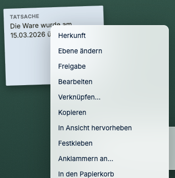
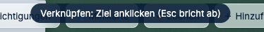
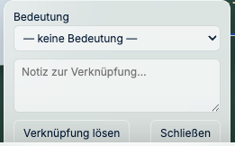
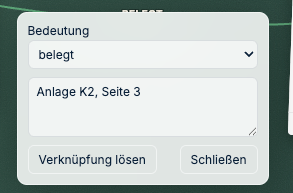
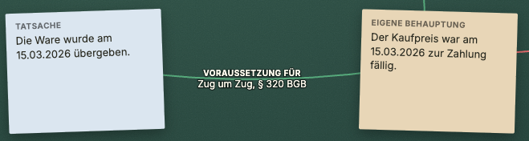
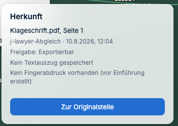
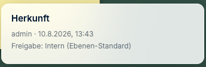

# Verknüpfen — der Kern

*Wenn Sie nur ein Kapitel lesen, dann dieses.*

---

## Warum das die eigentliche Arbeit ist

Ein Schriftsatz steht und fällt damit, ob jede Behauptung eine Fundstelle hat und ob Sie
wissen, was die Gegenseite dem entgegensetzt. Auf Papier führen Sie diese Verbindung im
Kopf oder mit Bleistiftlinien. In J-DESK wird sie zu einem festgehaltenen Umstand — den
Sie später auswerten können.

---

## Wie verknüpfe ich zwei Dinge?

Eine Verknüpfung entsteht in zwei Klicks — die Bedeutung geben Sie ihr danach.

**So geht's:**

1. **Rechtsklick** auf das erste Objekt → **„Verknüpfen…"**

   

2. Oben erscheint der Hinweis, dass J-DESK jetzt auf das Ziel wartet. Mit **Esc** brechen
   Sie ab, falls Sie sich vertan haben.

   

3. Auf das zweite Objekt **klicken**. Eine Linie erscheint — zunächst **gestrichelt und
   ohne Beschriftung**, denn sie hat noch keine Bedeutung.

4. **Die Linie anklicken.** Es öffnet sich ein kleines Fenster mit der Auswahl
   **„Bedeutung"** und einem Feld für eine Notiz.

   

5. Bedeutung wählen, gegebenenfalls eine Notiz dazuschreiben — etwa die Fundstelle
   „Anlage K2, Seite 3" — und **Schließen**.

   

Die Linie trägt danach Bedeutung und Notiz sichtbar auf dem Tisch, in der Farbe ihrer
Familie:

> **Stolperstein:** Eine Verknüpfung ohne gewählte Bedeutung bleibt bestehen — sie ist
> dann aber nur ein blasser Strich und taucht in keiner Auswertung als Beleg auf. Wenn
> Ihnen später gestrichelte Linien ohne Beschriftung auffallen: das sind
> Verknüpfungen, bei denen Schritt 5 vergessen wurde.

So sieht eine ausgearbeitete Stelle am Ende aus — Behauptung, Beleg und Gegenposition:

---

## Die elf Beziehungsarten

Nicht jede Verbindung bedeutet dasselbe. J-DESK unterscheidet elf Arten, gruppiert in drei
Familien — die Farbe der Linie zeigt die Familie:

### 🟢 Bestätigend (grüne Linie)

| Art | Wann |
|---|---|
| **belegt** | Die Fundstelle beweist die Behauptung |
| **bestätigt** | Stützt sie zusätzlich |
| **gehört zu** | Sachlicher Zusammenhang |
| **Folge von** | Ergibt sich zeitlich oder logisch daraus |
| **Voraussetzung für** | Ohne dies trägt das andere nicht |
| **unstreitig** | Zwischen den Parteien nicht im Streit |

### 🔴 Widersprechend (rote Linie)

| Art | Wann |
|---|---|
| **widerspricht** | Steht im Gegensatz dazu |
| **widerlegt** | Entkräftet es vollständig |
| **entkräftet** | Schwächt es ab |
| **streitig** | Die Parteien sehen es unterschiedlich |

### ⚪ Offen (gestrichelte Linie)

| Art | Wann |
|---|---|
| **offene Frage** | Noch ungeklärt — Ihre Hausaufgabe |

**Der Nutzen im Alltag:** Nach einer halben Stunde sehen Sie ohne Nachdenken, wo Ihr
Fundament steht (grün), wo gestritten wird (rot) und was noch offen ist (gestrichelt).

---

## Die dreizehn Objekttypen

Sie verknüpfen nicht nur Dokumente, sondern die Dinge, mit denen Sie juristisch arbeiten:

| Gruppe | Typen |
|---|---|
| **Tatsächliches** | Tatsache · eigene Behauptung · Behauptung der Gegenseite |
| **Beweis** | Beweismittel · Gegenbeweis · zitierfähige Fundstelle |
| **Rechtliches** | Rechtsfrage · Tatbestandsmerkmal · Einwendung |
| **Arbeit** | Risiko · Frist · Aufgabe · Ergebnis |

Jeder Typ ist auf dem Tisch farblich unterscheidbar. Eine Behauptung der Gegenseite sieht
anders aus als Ihre eigene — das erspart das Lesen beim Überfliegen.

---

## Jede Fundstelle bleibt auffindbar

Karten, die aus einem Dokument stammen — das Dokument selbst, Ausschnitte, Markierungen,
Stempel und Fähnchen — tragen ihre Herkunft mit sich.

**So geht's:** **Rechtsklick → „Herkunft"**.

Sie sehen **Dokument und Seite**, **woher die Karte kam und wann** (hier: aus dem
Abgleich mit j-lawyer), die **Freigabestufe** und ob ein **Textauszug** und ein
**Fingerabdruck** der Datei gesichert sind.

Der Knopf **„Zur Originalstelle"** springt in das Dokument an genau diese Stelle und hebt
sie kurz hervor. Bei Ausschnitten, Markierungen, Stempeln und Fähnchen steht derselbe
Sprung zusätzlich direkt im Kontextmenü.

Das funktioniert auch nach Verschieben, nach einer neuen Dokumentversion, nach Neustart
und nach Export.

**Beim Ausschneiden wird der Text zusätzlich gesichert.** Ändert sich das Quelldokument,
sehen Sie noch, was dort stand, als Sie es zitiert haben — wichtig, wenn die Gegenseite
eine korrigierte Fassung nachreicht. Steht dort „Kein Textauszug gespeichert", stammt die
Karte aus einer Zeit vor dieser Sicherung.

Bei Altbeständen ohne diese Angaben steht ehrlich **„Herkunft unbekannt"** statt einer
erfundenen Angabe.

**Bei Karten, die nicht aus einem Dokument stammen** — Zetteln, Stapeln, Verknüpfungen und
den juristischen Objekten — zeigt „Herkunft" nur, **wer sie angelegt hat, wann, und mit
welcher Freigabe**. Einen Sprung ins Dokument gibt es dort nicht, weil es keine
Dokumentstelle gibt: Diese Karten entstehen aus Ihrer Wertung.

> **Tipp:** Soll eine Behauptung trotzdem an ihrer Fundstelle hängen, schneiden Sie die
> Passage aus dem Dokument aus und **verknüpfen** Sie das Objekt mit dem Ausschnitt. Dann
> führt der Weg über die Verknüpfung zurück ins Dokument.

---

## Ausschnitte — wenn nur ein Absatz zählt

Selten ist ein ganzes Dokument die Fundstelle. Meist ist es ein Absatz auf Seite 213.

Schneiden Sie ihn heraus und legen Sie ihn als eigene Karte auf den Tisch. Der Weg zum
Original bleibt erhalten — Sie können jederzeit zurückspringen und den Zusammenhang prüfen.

Ausschnitte lassen sich verknüpfen wie alles andere. So steht am Ende nicht
„Klageschrift belegt die Fälligkeit", sondern die konkrete Passage.

---

## Versionsketten

Wenn ein Dokument eine neue Fassung eines anderen ist — der nachgereichte Vertrag, der
korrigierte Schriftsatz —, halten Sie das als Versionsbeziehung fest.

**So geht's:**

1. **Rechtsklick auf die neuere Fassung** → **„Ist neue Version von…"**
2. Die **ältere** Fassung anklicken

Der Pfeil zeigt danach von alt nach neu.

> **Stolperstein:** Die Richtung ist leicht zu verdrehen. Merken Sie sich: Sie starten
> immer bei dem Dokument, das Sie gerade in der Hand haben — der neuen Fassung — und
> zeigen dann auf das, was es ablöst.

Den Eintrag gibt es nur im Menü eines **Dokuments**, nicht bei Zetteln oder juristischen
Objekten. Direkt darüber steht **„Vergleichen mit…"**, wenn Sie die beiden Fassungen
nebeneinanderlegen wollen.

Eine Versionsbeziehung ist bewusst **keine** der elf Bedeutungen: Sie sagt nichts darüber
aus, ob etwas belegt oder bestritten wird. Sie lässt sich über beliebig viele Stufen
verfolgen.

---

**Weiter:** [Lücken finden](04-luecken-finden.md) ·
*Zurück zur [Schnellhilfe](README.md)*
