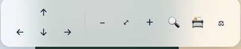
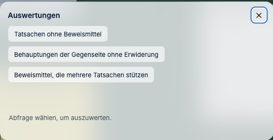
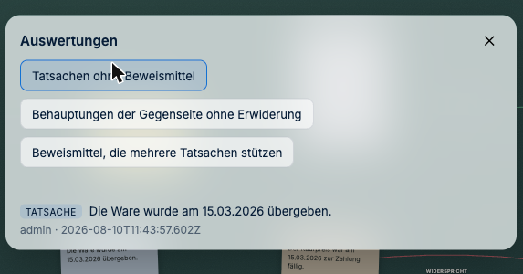
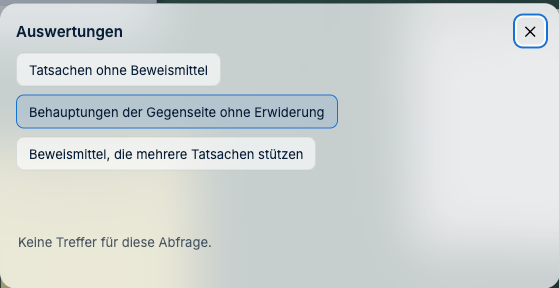

# Lücken finden

*Was das Gericht sonst findet.*

---

## Warum das der eigentliche Gewinn ist

Auf Papier können Sie eine Akte ordnen. Was Sie nicht können: sie **befragen**.

Sobald Sie Behauptungen und Belege verknüpft haben, kennt J-DESK die Struktur Ihres
Vortrags — und kann Ihnen sagen, wo etwas fehlt. Nicht inhaltlich, sondern strukturell.
Das ist der Unterschied zwischen einem Stapel Papier und einer Akte, mit der man arbeiten
kann.

## Wie öffne ich die Auswertung?

**So geht's:** Der Knopf mit der **Waage ⚖** ganz rechts in der **unteren** Leiste. Über
die Tastatur geht es mit **⌥⇧A**, und in der Befehlsliste heißt der Eintrag
**„Auswertung öffnen"**.

Es öffnet sich ein Fenster mit drei Fragen. Eine davon anklicken — dann wird gerechnet.

---

## „Welche Tatsachen habe ich ohne Beweismittel?"

Die wichtigste Frage vor jedem Schriftsatz.

J-DESK listet alle Karten der Art **Tatsache** auf, an denen **keine Verknüpfung mit der
Bedeutung „belegt"** zu einem Beweismittel hängt. Das sind genau die Stellen, an denen ein
Bestreiten der Gegenseite Sie in Beweisnot bringt.

**Was Sie damit tun:**
- Beweisangebot ergänzen (Zeuge, Urkunde, Sachverständiger)
- oder die Behauptung fallen lassen
- oder bewusst entscheiden, dass sie unstreitig bleiben wird — und das vermerken

> **Stolperstein — zwei Dinge, die viele überraschen:**
> 1. Es zählt **allein die Bedeutung „belegt"**. Eine Verknüpfung „bestätigt" oder
>    „gehört zu" macht die Tatsache in dieser Auswertung *nicht* belegt.
> 2. Es zählt nur die Verknüpfung zu einem **juristischen Objekt**, nicht zu einem
>    Dokument. Wer seine Tatsache direkt mit der Klageschrift verbindet, bleibt in der
>    Lückenliste stehen. Legen Sie stattdessen ein **Beweismittel** an — oder einen
>    Ausschnitt der Fundstelle — und verknüpfen Sie damit.
>
> Beides ist kein Fehler, sondern der Grund, warum die Liste verlässlich ist: Sie zählt
> nur, was Sie ausdrücklich als Beleg bezeichnet haben.

---

## „Was habe ich noch nicht erwidert?"

J-DESK listet alle Karten der Art **Behauptung der Gegenseite**, an denen **keine
widersprechende Verknüpfung** hängt. Hier zählt die ganze rote Familie —
*widerspricht*, *widerlegt*, *entkräftet*, *streitig*.

Der praktische Wert liegt auf der Hand: Unbestrittener Vortrag der Gegenseite kann als
zugestanden gelten. Diese Liste ist Ihre Kontrolle, bevor die Frist abläuft.

> **Stolperstein:** „Keine Treffer" heißt **nicht** „alles in Ordnung". Es heißt: In dem,
> was Sie erfasst haben, ist keine Lücke. Eine gegnerische Behauptung, die Sie nie als
> Karte angelegt haben, taucht hier auch nicht auf.

---

## „Welche Beweismittel stützen mehrere Tatsachen?"

Zeigt die Karten der Art **Beweismittel**, an denen **zwei oder mehr Tatsachen** mit
„belegt" hängen.

**Warum das wichtig ist:** Fällt ein solches Beweismittel weg — die Zeugin erinnert sich
nicht, die Urkunde wird bestritten —, brechen mehrere Punkte gleichzeitig weg. Diese
Abhängigkeit sollten Sie kennen, bevor der Termin sie offenlegt.

Umgekehrt zeigt die Liste, welcher Zeuge in der Vernehmung besonders sorgfältig
vorbereitet werden sollte.

---

## Wie komme ich von der Antwort zur Stelle?

**Jeder Eintrag in der Liste ist anklickbar.** Ein Klick schließt das Fenster und rückt
das Objekt auf dem Tisch in den Blick.

Stammt die Fundstelle aus einem Dokument, geht es von dort weiter über
**Rechtsklick → „Herkunft" → „Zur Originalstelle"** in die Unterlage hinein.

---

## Wenn die Liste lang wird

Die Trefferliste zeigt **höchstens 30 Einträge** — ohne Hinweis, dass es mehr sein
könnten. Bei einer großen Akte, die Sie zum ersten Mal auswerten, sollten Sie deshalb
nicht davon ausgehen, mit dem Abarbeiten der Liste fertig zu sein. Arbeiten Sie die
Treffer ab und **werten Sie erneut aus**, bis die Liste kürzer wird.

---

## Was die Auswertung nicht kann

Damit keine falsche Sicherheit entsteht:

- Sie prüft **Struktur, nicht Inhalt.** Ob eine Verknüpfung sachlich trägt, entscheiden
  ausschließlich Sie. J-DESK sieht nur, *dass* eine Verbindung besteht
- Sie kennt nur, **was erfasst ist.** Eine Behauptung, die Sie nicht angelegt haben,
  taucht in keiner Lückenliste auf
- Sie ersetzt **keine rechtliche Prüfung.** Ob Ihre Darlegungslast erfüllt ist, steht auf
  einem anderen Blatt

Der Nutzen bleibt trotzdem erheblich: Die Auswertung findet zuverlässig genau die Fehler,
die beim Durchlesen um 22 Uhr durchrutschen.

---

## Ein sinnvoller Ablauf

1. Akte durcharbeiten, Behauptungen und Beweismittel als Objekte anlegen
2. Verknüpfen — **belegt**, **widerspricht**, **streitig**
3. **Auswertung öffnen** und die drei Fragen durchgehen
4. Lücken schließen oder bewusst offen lassen
5. Vor dem Schriftsatz noch einmal auswerten

Schritt 5 ist der, den man weglässt, wenn es eilig wird — und genau der, der sich lohnt.

---

**Weiter:** [Chronologie und Vergleich](05-chronologie-und-vergleich.md) ·
*Zurück zur [Schnellhilfe](README.md)*
