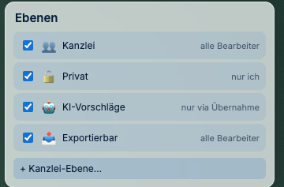

# Vertraulichkeit: interne Notizen und Schwärzungen

*Der wichtigste Abschnitt dieses Handbuchs. Bitte einmal ganz lesen.*

Sie unterliegen der anwaltlichen Verschwiegenheitspflicht (§ 43a BRAO, § 203 StGB). Ein Programm,
das Ihnen beim Arbeiten hilft, darf diese Pflicht nicht gefährden. Dieser Abschnitt erklärt, was
J-DESK dafür tut — und wo Ihre eigene Sorgfalt trotzdem gefragt bleibt.

## Der Grundsatz: im Zweifel intern

J-DESK kennt für jeden Inhalt auf Ihrem Schreibtisch drei Stufen:

| Stufe | Bedeutung |
|---|---|
| **intern** | Bleibt bei Ihnen. Erscheint **niemals** in einem Export. |
| **mandant** | Für Mandantengäste sichtbar, aber **nicht** in Export-Dokumenten. |
| **export** | Darf in Unterlagen, die das Haus verlassen. |

Womit Sie in der Anwendung arbeiten, sind **Ebenen**. Jede trägt sichtbar, wer sie sehen darf:

Entscheidend ist die Voreinstellung: **Was nicht ausdrücklich für den Export freigegeben ist,
gilt als intern.** Nicht umgekehrt.

Kann J-DESK bei einem Inhalt nicht sicher bestimmen, welche Stufe gilt, entscheidet es sich für
*intern*.

Der Grund ist einfach: Im schlimmsten Fall fehlt dann etwas in Ihrem Export — das sehen Sie und
können es nachtragen. Der umgekehrte Fehler wäre nicht reparabel. **Vertraulichkeit geht vor
Vollständigkeit.**

## Was das praktisch heißt

Ihre Bewertungen, Ihre Zwischenstände, Ihre Notizen an ein Dokument („Zeuge unglaubwürdig",
„hier hakt es", „Frist prüfen!") sind zunächst intern. Sie können sie unbesorgt schreiben. Wenn
Sie später ein Anlagenpaket für das Gericht erzeugen, sind diese Notizen nicht darin — nicht weil
Sie daran gedacht haben, sondern weil das der Normalzustand ist.

Umgekehrt bedeutet es: Wenn ein Inhalt in einem Export erscheinen *soll*, müssen Sie ihn
freigeben. Vermissen Sie etwas in einem Export, ist die Freigabestufe die erste Stelle zum
Nachsehen.

## Schwärzungen schwärzen wirklich

Eine Schwärzung, die den Text nur schwarz übermalt, ist keine Schwärzung. Der Text steht dann
weiterhin in der Datei und lässt sich mit Kopieren-und-Einfügen oder mit einfachen Werkzeugen
wieder sichtbar machen. Genau dieser Fehler hat schon Kanzleien und Behörden Schlagzeilen
eingebracht.

**J-DESK löscht den Text.** Beim Export werden die Textanweisungen innerhalb des geschwärzten
Bereichs aus der PDF-Datei entfernt, nicht überdeckt. Was weg ist, ist weg — auch für Kopieren,
Textsuche und Auslesewerkzeuge.

**Eine Schwärzung wirkt unabhängig von ihrer Freigabestufe.** Das ist die einzige Ausnahme
von der Regel dieses Kapitels — und sie muss es sein: Bei allem anderen schützt Weglassen
die Vertraulichkeit, bei einer Schwärzung würde Weglassen den Text freilegen. Sie müssen
eine Schwärzung also **nicht** erst freigeben, damit sie greift. Ziehen genügt.

Zwei zusätzliche Sicherungen:

- **Im Zweifel wird mehr gelöscht, nicht weniger.** In der Regel fällt **die ganze Zeile** weg,
  in der Sie geschwärzt haben — eine Zeile ist in einer PDF-Datei meist eine einzige Anweisung,
  die sich nicht in der Mitte auftrennen lässt. Zu viel Gelöschtes sehen Sie sofort; übrig
  gebliebener Text wäre der gefährliche Fall. Mehr dazu in
  [Export und Schwärzen](07-export-und-schwaerzen.md#so-sieht-das-aus).
- **Es wird nachgeprüft.** Nach dem Schwärzen liest das Programm die erzeugte Datei noch einmal
  und sucht darin nach Text, der eigentlich verschwunden sein müsste. Findet es welchen, bricht
  der Export ab, statt Ihnen eine unsichere Datei zu geben.

Bei ungewöhnlich aufgebauten PDF-Dateien — etwa gedrehten Seiten — verweigert J-DESK die
Bearbeitung lieber, als heimlich an der falschen Stelle zu schwärzen. Dann erhalten Sie eine
Meldung statt eines Ergebnisses.

## Wo Ihre Sorgfalt trotzdem gefragt ist

Kein Programm nimmt Ihnen die Verantwortung ab. Drei Dinge bleiben bei Ihnen:

**1. Sehen Sie den Export an, bevor er das Haus verlässt.** J-DESK filtert zuverlässig nach den
Stufen, die *gesetzt* sind. Haben Sie eine interne Notiz versehentlich auf „export" gestellt, tut
das Programm, was Sie ihm gesagt haben. Ein kurzer Blick auf das fertige Dokument ist durch nichts
zu ersetzen.

**2. Prüfen Sie bei Schwärzungen den Inhalt, nicht nur die Form.** J-DESK entfernt den Text unter
dem Balken. Es weiß aber nicht, ob derselbe Name drei Seiten später erneut steht oder ob sich die
geschwärzte Person aus dem Zusammenhang erschließen lässt.

**3. Bedenken Sie, was Sie an eine KI geben.** Wenn Sie die KI-Unterstützung nutzen, verlassen die
übermittelten Inhalte Ihr Haus. Das geschieht nur auf Ihre Veranlassung und wird protokolliert,
aber es geschieht. Prüfen Sie vorher, ob der übermittelte Ausschnitt Mandatsgeheimnisse enthält.

Dafür gibt es die **Anonymisierung**: Namen werden vor der Übermittlung durch Platzhalter
ersetzt und danach wieder eingesetzt — siehe [Anonymisieren](09-anonymisieren.md).

## Wer sieht was?

- **Ihre Schreibtische** sind Ihnen zugeordnet. Andere sehen sie nur, wenn Sie sie freigeben.
- **Bei Anbindung an j-lawyer** gelten die dortigen Zugriffsrechte für Akten und Dokumente.
- **Mandantengäste** sehen ausschließlich, was auf „mandant" oder „export" steht — interne
  Inhalte bleiben unsichtbar.

Die Prüfung, wer worauf zugreifen darf, findet dabei immer auf dem Server statt, nicht nur in der
Anzeige. Ein ausgeblendeter Knopf ist keine Sicherung — eine serverseitige Prüfung schon.

## Im Zweifel

Wenn Sie unsicher sind, ob ein Inhalt in einem Export landen würde, gibt es die Funktion
**„Sichtbarkeit prüfen"** im Kontextmenü einer Karte (verfügbar für Eigentümer eines
Schreibtisches). Sie zeigt Ihnen für einen ausgewählten Nutzer, was davon sichtbar ist und warum.

---

**Zurück:** [Was ist J-DESK?](01-was-ist-j-desk.md) · **Übersicht:** [Handbuch](../README.md)
