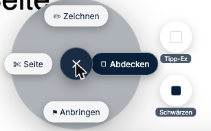

# Export und Schwärzen

*Was das Haus verlässt.*

Dieses Kapitel ergänzt [Vertraulichkeit](06-vertraulichkeit.md) um die praktische Seite.
Wenn Sie nur eines von beiden lesen, lesen Sie jenes.

---

## Was kann ich exportieren?

**Sechs Formate liegen zusammen** hinter **Schreibtisch-Menü → „Übergabe…"**:

| Format in der Oberfläche | Wofür |
|---|---|
| **Annotierte PDF-Kopie** | Ein Dokument mit Ihren freigegebenen Markierungen |
| **Fundstellen-PDF** | Nur die Stellen, auf die es ankommt — mit Seitenausschnitt und Herkunftsnachweis |
| **Schreibtisch-Snapshot** | Wie die Akte gerade aussieht, mit Verzeichnis der Objekte |
| **Argumentationsübersicht** | Welche Behauptung worauf gestützt ist |
| **Beweismittelübersicht** | Was womit bewiesen werden soll |
| **Aufgabenliste** | Was noch offen ist |

**So geht's:**

1. **Schreibtisch-Menü → „Übergabe…"**
2. Format wählen. Bei der annotierten Kopie zusätzlich unter **Umfang** das Dokument
   auswählen.
3. Die **Freigabe-Statistik** darunter lesen — dazu gleich mehr.
4. **Übergabe erzeugen**.

**Zwei weitere Ausgaben liegen woanders:**

| Format | Wo |
|---|---|
| **Anlagenpaket** (K1, K2 … mit Deckblatt und Verzeichnis) | Schreibtisch-Menü → „Anlagenpaket…" oder Rechtsklick auf ein Dokument → [ReFa-Kapitel 3](../refa/03-anlagenpaket.md) |
| **Arbeitsstand als Paket** (der ganze Schreibtisch, portabel) | Schreibtisch-Menü → „Arbeitsstand exportieren…" |

Besonders nützlich bei der **Mandatsübernahme**: Die Argumentationsübersicht sagt einer
Kollegin in fünf Minuten, was sie sonst aus 400 Seiten erschließen müsste.

### Die Freigabe-Statistik lesen

Vor jeder Erzeugung zeigt der Dialog, was tatsächlich mitgeht:

> **Im Export enthalten: 1 Objekte**
> Nicht enthalten: 0 intern · 0 mandantensichtbar

Diese Zeile ist Ihre letzte Kontrolle vor dem Erzeugen. Ist die Zahl der enthaltenen
Objekte kleiner, als Sie erwarten, fehlt eine Freigabe — und umgekehrt: Ist sie größer als
gedacht, sehen Sie sich an, was da alles mitgeht, **bevor** Sie die Datei verschicken.

---

## Wandern meine internen Notizen mit?

**Nein.** Was nicht ausdrücklich für den Export freigegeben ist, gilt als intern und wird
herausgefiltert. Automatisch, ohne dass Sie daran denken müssen.

**Aber:** Wenn ein Inhalt bewusst auf *exportierbar* gestellt wurde, tut J-DESK, was ihm
gesagt wurde. Ein Blick auf das fertige Dokument vor dem Versand ist durch nichts zu
ersetzen.

---

## Wie schwärze ich richtig?

Markieren Sie die Stelle und schwärzen Sie sie. Beim Export geschieht dann etwas, das die
meisten Programme **nicht** tun:

**J-DESK entfernt den Text aus der PDF-Datei.** Er wird nicht schwarz übermalt, sondern
gelöscht.

**So geht's:**

1. Dokument **aufschlagen** (Doppelklick oder Rechtsklick → „Aufschlagen").
2. **Rechtsklick** in die Seite — das Werkzeugrad erscheint.
3. **„Abdecken"** wählen, dann **„Schwärzen"**.
4. Über die Stelle ziehen, die verschwinden soll.

> **Im Programm heißt die Gruppe „Abdecken".** Darin liegen zwei Werkzeuge: **Schwärzen**
> (schwarzer Balken) und **Tipp-Ex** (weiße Fläche). Beide entfernen den Text beim Export
> gleichermaßen — der Unterschied ist nur, wie die Stelle im Ergebnis aussieht. Weiß wirkt
> unauffälliger, schwarz macht die Auslassung sichtbar; für gerichtliche Vorlagen ist das
> in aller Regel die richtige Wahl.

### Warum das der entscheidende Unterschied ist

Ein schwarzes Rechteck über einem Text ist eine Grafik. Der Text steht weiterhin darunter
in der Datei und lässt sich mit Kopieren-und-Einfügen, mit der Textsuche oder mit
einfachen Werkzeugen wieder sichtbar machen.

Genau dieser Fehler hat schon Behörden und Kanzleien in die Zeitung gebracht — mit
offengelegten Namen von Zeugen, Kontodaten und Gesundheitsangaben.

### Die drei Sicherungen

**Die Schwärzung wirkt immer.** Anders als jede andere Markierung müssen Sie eine
Schwärzung nicht für den Export freigeben. Sie greift, sobald Sie sie gezogen haben —
sonst könnte eine vergessene Freigabe genau das Gegenteil bewirken.

**Im Zweifel wird mehr entfernt, nicht weniger.** Lässt sich nicht eindeutig bestimmen, ob
ein Textstück noch in den geschwärzten Bereich fällt, wird es entfernt. Zu viel Geschwärztes
sehen Sie sofort und können nachbessern; übrig gebliebener Text wäre der gefährliche Fall.

**Es wird nachgeprüft.** Nach dem Schwärzen liest das Programm die erzeugte Datei erneut
und sucht nach Text, der verschwunden sein müsste. Findet es welchen, **bricht der Export
ab** — Sie bekommen eine Meldung statt einer unsicheren Datei.

> **Stolperstein — auf derselben Zeile kann mehr verschwinden, als der Balken zeigt.**
> Bei Tabellen und mehrspaltigen Zeilen kann Text **links** der geschwärzten Stelle
> mitentfernt werden, obwohl er im Bild noch steht. Das ist die Richtung, in die J-DESK
> im Zweifel irrt — lieber zu viel weg als zu wenig. Sehen Sie sich deshalb bei Tabellen
> das **fertige** Dokument an, nicht nur den Bildschirm.

### Wenn J-DESK sich weigert

Bei ungewöhnlich aufgebauten PDF-Dateien — etwa gedrehten Seiten oder schräg gesetztem
Text — verweigert J-DESK die Bearbeitung, statt an der falschen Stelle zu schwärzen. Sie
sehen dann diese Meldung, und es entsteht **keine Datei**:

> Die Schwärzung konnte nicht verifiziert werden; der Export wurde abgebrochen, damit
> kein ungeprüftes Dokument entsteht.

Das ist der Satz, den Sie lesen wollen, wenn etwas nicht stimmt — eine Fehlermeldung ist
besser als eine Datei, die aussieht, als sei sie geschwärzt.

In dem Fall hilft meist, das Dokument neu zu erzeugen oder als Bild zu rastern. Kommt die
Meldung bei einem gewöhnlichen Schriftsatz, sagen Sie Ihrer Technikbetreuung Bescheid —
dann stimmt etwas anderes nicht.

---

## Was J-DESK Ihnen nicht abnimmt

**Den inhaltlichen Blick.** J-DESK entfernt den Text unter dem Balken. Es weiß nicht, ob
derselbe Name drei Seiten später erneut steht, ob sich die geschwärzte Person aus dem
Zusammenhang erschließen lässt oder ob die Aktenzeichen der Gegenseite Rückschlüsse
erlauben.

Die Prüfung, ob das Ergebnis den Zweck erfüllt, bleibt bei Ihnen.

---

## Wer darf exportieren?

Export ist eine rollengebundene Handlung — wie endgültiges Löschen und Hochladen. Wer
welche Rolle hat, richtet die Technikbetreuung ein
([Benutzer und Rechte](../technik/04-benutzer-und-rechte.md)).

Jeder Export erscheint zudem in der **Historie**, mit Auslöser und Zeitpunkt. Bei einer
späteren Frage, was wann an wen ging, ist das die belastbare Auskunft.

---

**Weiter:** [Termin und KI](08-termin-und-ki.md) ·
*Zurück zur [Schnellhilfe](README.md)*
