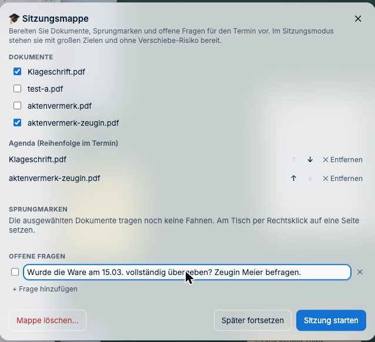
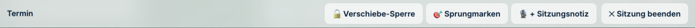
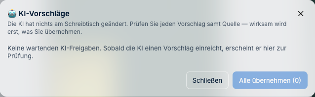

# Termin, unterwegs und KI

---

## Der Verhandlungstermin

Ein Laptop mit Mauszeiger ist im Sitzungssaal unbrauchbar. Deshalb gibt es einen eigenen
Modus.

### Vorbereiten: die Sitzungsmappe

Stellen Sie vorab zusammen, was Sie im Termin brauchen. Das ist die Arbeit, die man sonst
am Vorabend mit Haftnotizen macht — nur dass sie nicht verrutscht.

**So geht's:**

1. **Schreibtisch-Menü → „Sitzungsmappe…"** (hinter dem Aktenzeichen oben links).
2. Unter **Dokumente** ankreuzen, was mit soll. Jedes angekreuzte Dokument erscheint
   darunter in der **Agenda** — der Reihenfolge, in der Sie es im Termin brauchen. Mit den
   Pfeilen ↑ ↓ sortieren, mit **✕ Entfernen** wieder herausnehmen.
3. Unter **Offene Fragen** notieren, was Sie im Termin klären wollen — mit **+ Frage
   hinzufügen**.
4. **Später fortsetzen** speichert die Mappe; **Sitzung starten** schaltet in den
   Sitzungsmodus.

Einzelne Karten nehmen Sie auch direkt vom Tisch auf: **Rechtsklick → „Zur Sitzungsmappe
hinzufügen"**.

**Sprungmarken** sind Fahnen an einer bestimmten Seite. Die setzen Sie nicht in diesem
Fenster, sondern am Tisch: Dokument aufschlagen, **Rechtsklick in die Seite → Anbringen →
Fahne**, dann die Farbe wählen. In der Sitzungsmappe erscheinen sie danach als
anspringbare Liste.

### Im Termin: der Sitzungsmodus

Der Sitzungsmodus ersetzt die obere Leiste durch vier große Bedienziele:

- **🔒 Verschiebe-Sperre** — ein Umschalter. Ist sie an, rutscht nichts weg, wenn Sie den
  Bildschirm berühren. Die Beschriftung sagt Ihnen, woran Sie sind: *Verschiebe-Sperre
  aktiv* heißt gesperrt.
- **🎯 Sprungmarken** — die vorbereiteten Stellen als Liste; ein Tippen führt hin. Sind
  keine gesetzt, steht das ausdrücklich da.
- **🎙 + Sitzungsnotiz** — ein großes Textfeld; die Notiz bleibt später als Sitzungsnotiz
  erkennbar. Hat Ihre Kanzlei das Diktat eingerichtet, steht darunter zusätzlich
  **🎤 Diktieren**.
- **✕ Sitzung beenden** — zurück zum normalen Schreibtisch.

Schrift und Schaltflächen sind durchgehend größer als sonst, damit man sie im Stehen und
im Saallicht trifft. Notizen werden **zwischengespeichert**, wenn das Netz im Saal schwach
ist, und später nachgereicht.

Der Punkt ist nicht Bequemlichkeit: Wenn das Gericht nach einer Fundstelle fragt, zählt,
ob Sie sie in fünf Sekunden oder in zwei Minuten auf dem Schirm haben.

> **Stolperstein:** Die Sitzungsmappe gehört zum Schreibtisch, nicht zum Termin. Sie
> bleibt nach dem Beenden erhalten — praktisch für den Fortsetzungstermin, aber räumen Sie
> sie auf, bevor Sie mit derselben Akte in einen anderen Termin gehen.

---

## Unterwegs

**Auf dem iPad:** Lesen, Markieren, Ordnen, Sitzungsmodus, Eingabe mit dem Pencil. Für die
Vorbereitung im Zug oder den Termin selbst.

**Auf dem Smartphone:** Bewusst **keine** volle Oberfläche — ein Schreibtisch auf sechs
Zoll hilft niemandem. Stattdessen das, was unterwegs Sinn ergibt:

- Schnellzugriff auf die Akte
- fotografieren und hochladen
- diktieren
- Aufgaben abhaken

---

## Diktieren

Notizen, Gedanken und Aufgaben sprechen statt tippen.

**Für die Verschwiegenheit relevant:** Die Aufnahme geht an den Server Ihrer Kanzlei, der
sie zur Umwandlung in Text weiterreicht. Sie wird **nirgends abgelegt**, und der
Zugangsschlüssel erreicht Ihren Browser nie.

Die Spracherkennung des Browsers wird dabei **nicht** verwendet — sie würde den Ton an
dessen Hersteller senden. Wenn Sie im Rahmen einer § 43e-Prüfung nach Auftragsverarbeitern
gefragt werden, ist das der relevante Punkt. Mehr dazu:
[Anonymisieren](09-anonymisieren.md#wo-landet-der-schlüssel).

---

## KI

J-DESK kann eine KI hinzuziehen — etwa um Fundstellen zu einer Behauptung
vorzuschlagen. Das Verhältnis dazu ist bewusst misstrauisch gestaltet.

### Vier Regeln, die immer gelten

**1. Vorher fragen.** Eine schreibende KI-Aktion zeigt vorab an, was sie tun möchte, und
läuft erst nach Ihrer Freigabe. Sie können alles übernehmen, einzeln entscheiden oder
ablehnen.

**2. Immer zurücknehmbar.** Jede KI-Aktion lässt sich rückgängig machen und steht in der
Historie. **Die KI ordnet niemals unsichtbar Ihren Schreibtisch um.**

**3. Quellenpflicht.** Jede Ausgabe nennt Quelle, Seite und die genaue Textstelle. Eine
Behauptung ohne Fundstelle ist für die Akte wertlos — das gilt für die KI genauso wie für
Menschen.

**4. Vorschlag bleibt Vorschlag.** Ergebnisse entstehen auf einer eigenen Ebene
(„KI-Vorschläge") und werden erst nach Ihrer Bestätigung zu regulären Objekten der Akte.

### Was Sie trotzdem bedenken müssen

Wenn Sie die KI-Unterstützung nutzen, **verlassen die übermittelten Inhalte Ihr Haus**. Das
geschieht nur auf Ihre Veranlassung und wird protokolliert — aber es geschieht.

Prüfen Sie vorher, ob der übermittelte Ausschnitt Mandatsgeheimnisse enthält. Falls Ihre
Kanzlei die Anonymisierungsfunktion eingerichtet hat, ziehen Sie sie in Betracht.

### Wo sehe ich, was die KI vorschlägt?

**So geht's:** **Schreibtisch-Menü → „🤖 KI-Freigaben…"**. Über die Befehlsliste heißt der
Eintrag **„KI-Freigaben öffnen"** — derselbe Weg.

Das Fenster heißt in der Oberfläche **KI-Vorschläge** und ist der einzige Ort, an dem
KI-Ergebnisse in Ihre Akte gelangen:

Steht dort — wie im Bild — **„Die KI hat nichts am Schreibtisch geändert"** und **„Keine
wartenden KI-Freigaben"**, dann ist auch nichts geschehen. Liegen Vorschläge an, prüfen Sie
sie einzeln samt Quelle und entscheiden für jeden. **Alle übernehmen** nimmt sie
gesammelt an; die Zahl daneben sagt, wie viele es sind.

> **Stolperstein:** Der Eintrag ist immer sichtbar, auch wenn Ihre Kanzlei gar keine KI
> angebunden hat. Ein leeres Fenster heißt also nicht zwingend „die KI hat nichts
> gefunden" — es kann auch heißen, dass keine KI im Spiel ist.

---

## Und wenn etwas schiefgeht?

Die **Historie** zeigt, wer wann was geändert hat — einschließlich KI-Aktionen und Exporte,
jeweils mit der Person, die sie ausgelöst oder genehmigt hat. Ein früherer Stand lässt sich
vollständig wiederherstellen.

---

*Zurück zur [Schnellhilfe](README.md) · [Handbuch-Übersicht](../README.md)*
