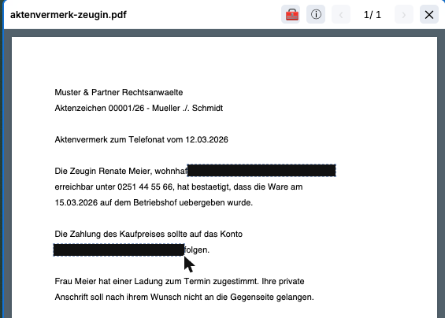

# Anonymisieren

*Namen und Daten durch Platzhalter ersetzen, bevor etwas das Haus verlässt.*

---

## Worum geht es?

Wenn Sie eine KI zu Rate ziehen, verlassen die übermittelten Inhalte Ihre Kanzlei. Bei
Mandatsdaten ist das die heikelste Stelle der ganzen Anwendung.

Die Anonymisierung setzt genau dort an: Bevor ein Text hinausgeht, werden Namen und
personenbezogene Angaben durch **Platzhalter** ersetzt. Aus „Frau Meier" wird
`[[person-XYZ]]`. Die KI arbeitet mit dem Platzhalter, Sie bekommen die Antwort zurück —
und J-DESK setzt die echten Namen wieder ein.

Die Zuordnung, welcher Platzhalter für welchen Namen steht, bleibt dabei **in Ihrer
Kanzlei**.

---

## Anonymisieren ist nicht Schwärzen

Die beiden werden oft verwechselt, tun aber Verschiedenes — und die Verwechslung kann teuer
werden:

| | **Schwärzen** | **Anonymisieren** |
|---|---|---|
| Was passiert | Text wird **entfernt** | Text wird **ersetzt** |
| Umkehrbar | **Nein**, endgültig | **Ja**, über die Zuordnung |
| Wozu | Unterlagen, die aus dem Haus gehen (Gericht, Gegenseite) | Inhalte, die zur KI gehen und deren Antwort Sie zurückbrauchen |
| Ergebnis | schwarzer Balken, Text ist weg | lesbarer Text mit `[[person-XYZ]]` |

**Faustregel:** Was das Gericht sieht, wird geschwärzt. Was die KI sieht, wird anonymisiert.

**Geschwärzt** sieht so aus — die Stelle ist zu, der Text im Ergebnis gelöscht:



**Anonymisiert** sieht dagegen so aus — der Satz bleibt lesbar, nur die Person ist ersetzt:

```
Die Zeugin [[person-4F2A]] hat bestaetigt, dass die Ware am
15.03.2026 uebergeben wurde.
```

Die Platzhalter haben die Form `[[Art-Kennung]]`; welche Arten vorkommen, hängt davon ab,
was der Dienst im Text findet.

Der Unterschied in einem Satz: Beim Schwärzen ist die Aussage weg, beim Anonymisieren
bleibt sie — nur ohne Namen. Deshalb kann die KI mit anonymisiertem Text arbeiten, mit
geschwärztem nicht.

Für das Schwärzen siehe [Export und Schwärzen](07-export-und-schwaerzen.md).

---

## Wo drücke ich dafür?

**Nirgends — und das ist Absicht.** Die Anonymisierung hat keinen Knopf auf dem
Schreibtisch. Sie greift dort, wo sie gebraucht wird: an der Schnittstelle, über die eine
KI Ihre Akte liest.

Fragt eine KI über diese Schnittstelle nach Ihren Akten, bekommt sie durchgehend
anonymisierte Inhalte:

- die **Namen der Schreibtische**, wenn sie sich einen Überblick verschafft
- den **Text eines Dokuments**, wenn sie es liest
- den **Text einer einzelnen Seite**, wenn sie gezielt nachschlägt

Sie können das nicht vergessen und nicht versehentlich überspringen. Erkannt werden
personenbezogene Angaben; was genau gefunden wird, entscheidet der Anonymisierungsdienst.

> **Grenze:** Sehr lange Texte werden bei rund 100.000 Zeichen abgeschnitten; die KI sieht
> dann den Hinweis „Text gekürzt". Dateien über 25 MB werden abgelehnt.

---

## Der wichtigste Punkt für die berufsrechtliche Prüfung

Damit Text anonymisiert werden kann, muss er **zuerst zum Anonymisierungsdienst** — anders
geht es nicht: Der Dienst ist es, der die Namen findet und ersetzt. Bei einem Dokument wird
dafür die **Datei selbst** übergeben.

Es sind also **zwei** Empfänger im Spiel, nicht einer:

1. der **Anonymisierungsdienst**, der den Klartext sieht
2. der **KI-Dienst**, der nur noch die Platzhalter sieht

Für eine Prüfung nach § 43e BRAO heißt das: Beide sind zu betrachten. Der Gewinn der
Anonymisierung liegt darin, dass der KI-Dienst — typischerweise der weiter entfernte und
weniger vertraglich gebundene — den Klartext nie erhält. Er liegt nicht darin, dass die
Daten das Haus nicht verlassen.

Welcher Anonymisierungsdienst eingesetzt wird und was vertraglich mit ihm vereinbart ist,
weiß Ihre Technikbetreuung.

---

## Kann ich die echten Namen zurückbekommen?

**In der Regel ja.** Das ist der Unterschied zum Schwärzen: Die Zuordnung von Platzhalter zu
Original wird gespeichert, und die Rückübersetzung setzt die echten Namen wieder ein.

**Zwei Fälle, in denen es nicht geht:**

1. **Ihre Kanzlei hat die Rückübersetzung abgeschaltet.** Das ist eine bewusste
   Einstellung — wenn Vertraulichkeit über Bequemlichkeit gehen soll, kann die
   Technikbetreuung sie deaktivieren.

2. **Ihr Anonymisierungskonto speichert nichts** („Zero Data Retention"). Dann existiert
   die Zuordnung beim Dienst gar nicht erst. Sie erhalten die Meldung *„De-Anonymisierung
   nicht verfügbar"*.

Der zweite Fall ist kein Fehler, sondern eine Sicherheitseinstellung. Wenn Sie die
Rückübersetzung brauchen, klären Sie das mit Ihrer Technikbetreuung, **bevor** Sie mit
anonymisierten Texten arbeiten.

---

## Wo landet der Schlüssel?

Der Zugangsschlüssel für den Anonymisierungsdienst liegt **auf Ihrem Server**, nicht im
Browser. Alle Anfragen laufen über den Server Ihrer Kanzlei.

Das gilt auch fürs **Diktat**: Die Aufnahme geht an Ihren Server, der sie zur Umwandlung in
Text weiterreicht. Der Schlüssel erreicht den Browser nie, und die Aufnahme wird nirgends
abgelegt.

Praktisch bedeutet das: Ein Angreifer, der einen Arbeitsplatzrechner übernimmt, findet dort
keinen Zugang zum Anonymisierungsdienst.

---

## Was die Anonymisierung nicht leistet

Drei Grenzen, die Sie kennen sollten:

**Sie ersetzt nicht Ihr Urteil.** Der Dienst erkennt Namen und typische personenbezogene
Angaben. Er erkennt nicht, dass sich aus „der Geschäftsführer der einzigen Molkerei im
Landkreis" die Person zweifelsfrei ergibt. Solche Umschreibungen bleiben stehen.

**Sie ist keine Zusage nach außen.** Ob eine Übermittlung an einen KI-Dienst berufsrechtlich
zulässig ist, entscheidet nicht die Technik. Anonymisierung senkt das Risiko, sie beseitigt
die Prüfpflicht nicht.

**Sie greift nur, wo sie angewandt wird.** Ein Dokument, das Sie ohne Anonymisierung an die
KI geben, geht so hinaus, wie es ist.

---

## Ist der Dienst nicht erreichbar?

Dann bricht der Vorgang ab, statt den Text ungeschützt weiterzugeben. Sie erhalten eine
Meldung — je nachdem, ob der Dienst nicht antwortet, die Verarbeitung fehlschlug oder die
Wartezeit überschritten wurde.

Das ist die richtige Richtung: Lieber kein Ergebnis als ein Klartext-Versand.

---

**Zurück:** [Termin und KI](08-termin-und-ki.md) ·
[Vertraulichkeit](06-vertraulichkeit.md) · *[Schnellhilfe](README.md)*
