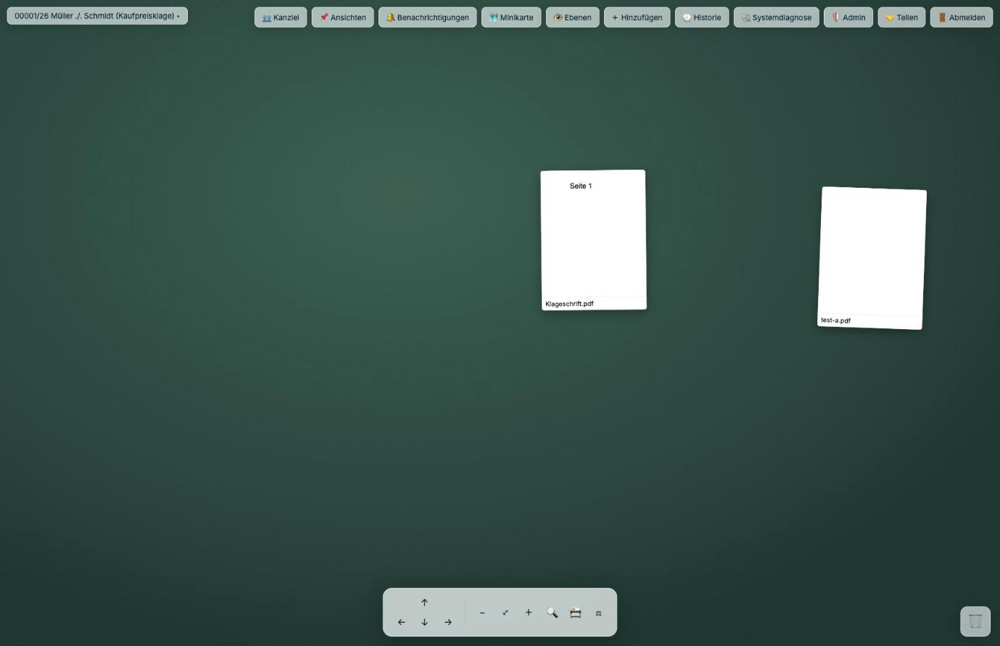

# Der erste Schreibtisch

*Die ersten Handgriffe. Rechnen Sie mit einer Viertelstunde, bis sich das Ganze vertraut anfühlt.*

## Anmelden

Ihre Kanzlei nennt Ihnen eine Adresse, meist in dieser Form:

```
http://kanzlei-server:4810
```


**Ist J-DESK mit j-lawyer verbunden** (der Normalfall), melden Sie sich mit **denselben
Zugangsdaten wie bei j-lawyer** an. Kein zweites Passwort, kein zweites Konto.

**Arbeitet J-DESK eigenständig**, hat Ihre Technikbetreuung Ihnen ein Konto angelegt oder Sie
legen beim allerersten Aufruf selbst eines an.

## Eine Akte auf den Tisch holen

Nach der Anmeldung wählen Sie eine Akte. J-DESK zeigt Ihnen die Akten aus j-lawyer — dieselben,
die Sie dort auch sehen, mit Aktenzeichen, Beteiligten und Gegenstand.

Wählen Sie eine aus, und die Dokumente stehen bereit.



Oben links steht, in welcher Akte Sie sich befinden — hier *00001/26 Müller ./. Schmidt
(Kaufpreisklage)*. Über das Feld wechseln Sie zu einer anderen. Oben rechts liegt die Kopfleiste
mit Ansichten, Ebenen, Historie und den übrigen Werkzeugen; unten in der Mitte die Leiste zum
Bewegen und Zoomen.

**Zur Erinnerung:** Es entsteht dabei keine Kopie. Die Dokumente bleiben in j-lawyer. J-DESK legt
sie Ihnen nur auf den Tisch.

## Sich auf der Fläche bewegen

Der Schreibtisch ist größer als Ihr Bildschirm — wie ein Tisch, an dem Sie sitzen und den Kopf
drehen.

| Was Sie wollen | Wie |
|---|---|
| Die Fläche verschieben | Leertaste halten und ziehen, oder auf leere Fläche klicken und ziehen |
| Näher heran / weiter weg | Mausrad, oder die Zoomknöpfe am Rand |
| Ein Dokument bewegen | Anfassen und ziehen wie ein Blatt Papier |
| Ein Dokument lesen | Doppelklick, oder Rechtsklick → **Aufschlagen** |

Wenn Sie die Übersicht verlieren, hilft die **Minikarte** — sie zeigt die ganze Fläche im Kleinen
und wo Sie sich gerade befinden.

## Das Kontextmenü — der Weg zu allem

Ein **Rechtsklick auf ein Dokument** öffnet das Menü mit allem, was Sie damit tun können:


| Eintrag | Was er tut |
|---|---|
| **Herkunft** | Woher stammt dieses Dokument, wer hat es wann eingebracht |
| **Aufschlagen** | Öffnet es zum Lesen |
| **In neuem Tab öffnen** | Zum Vergleichen nebeneinander |
| **Mit allen Verknüpften öffnen** | Öffnet es samt allem, was Sie damit verknüpft haben |
| **Verknüpfen…** | Startet eine Verbindung zu einem anderen Dokument |
| **Kopieren** | Legt eine zweite Karte desselben Dokuments an |
| **Herunterladen…** | Speichert es auf Ihrem Rechner |

Rechtsklick auf **leere Fläche** bringt das Menü für den Schreibtisch selbst: Notizzettel anlegen,
Dokument aufnehmen, aufräumen.

## Die wichtigste Handbewegung: verknüpfen

Das ist der Kern von J-DESK. Alles andere ist Beiwerk.

1. Rechtsklick auf das erste Dokument → **Verknüpfen…**
2. Auf das zweite Dokument klicken
3. Eine Linie erscheint


Klicken Sie diese Linie an, öffnet sich ein kleines Fenster, in dem Sie festlegen, **worin die
Beziehung besteht**:

- *belegt*, *bestätigt*, *gehört zu*, *Folge von*, *Voraussetzung für*, *unstreitig* — die
  Linie wird grün
- *widerspricht*, *widerlegt*, *entkräftet*, *streitig* — die Linie wird rot
- *offene Frage* — die Linie wird gestrichelt

Dazu können Sie eine Notiz schreiben („Seite 12, dritter Absatz").

Nach einer halben Stunde Arbeit sehen Sie auf einen Blick: grüne Linien sind Ihr Fundament, rote
sind die Streitpunkte, gestrichelte sind Ihre Hausaufgaben.

## Notizen

Rechtsklick auf leere Fläche → Notizzettel. Er liegt frei auf dem Tisch, für Gedanken, die zu
keinem einzelnen Dokument gehören.

Notizen sind standardmäßig **intern** — sie erscheinen nicht in Exporten. Warum das so ist und
worauf Sie trotzdem achten sollten, steht in [Vertraulichkeit](vertraulichkeit.md).

## Wenn es unübersichtlich wird

- **Stapeln** — mehrere Karten aufeinanderlegen, wie einen Papierstapel
- **Ansichten** — einen Blickwinkel speichern („Nur das zum Verzug") und später zurückkehren
- **Hervorheben** — Rechtsklick → *In Ansicht hervorheben* markiert Wichtiges
- **Aufräumen** — schlägt vor, was zusammengehören könnte; Sie entscheiden

## Ihre Arbeit ist gesichert

Sie müssen nichts speichern. Jede Bewegung wird sofort festgehalten. Schließen Sie den Browser,
liegt am nächsten Morgen alles unverändert da.

Arbeiten zwei Personen gleichzeitig am selben Schreibtisch, sehen beide die Änderungen der
anderen. Ändern beide **dasselbe** gleichzeitig, meldet sich J-DESK und fragt, welche Fassung
gelten soll — statt still eine davon zu verwerfen.

---

**Zurück:** [Was ist J-DESK?](was-ist-j-desk.md) · **Weiter:** [Vertraulichkeit](vertraulichkeit.md)
