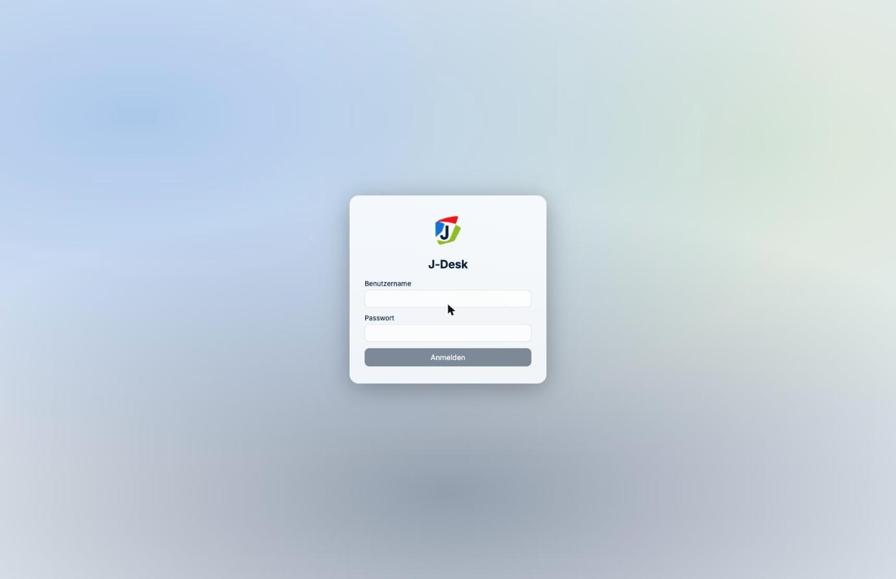
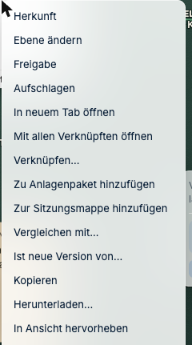
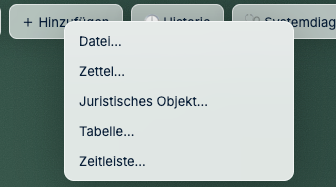
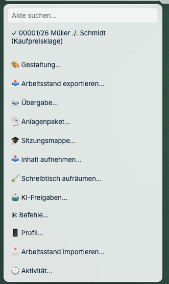

# Erste Schritte

*Für den allerersten Tag. Rechnen Sie mit zehn Minuten.*

---

## Wie melde ich mich an?

Ihre Technikbetreuung nennt Ihnen eine Adresse, etwa `http://kanzlei-server:4810`. Legen
Sie sich ein Lesezeichen an.

**Ihre Zugangsdaten sind dieselben wie bei j-lawyer.** Kein zweites Passwort, kein neues
Konto.

> **Es klappt nicht?** Prüfen Sie zuerst, ob Sie sich bei j-lawyer selbst anmelden können.
> Geht das auch nicht, liegt es am Passwort und nicht an J-DESK. Geht j-lawyer, aber
> J-DESK nicht, fragen Sie Ihre Technikbetreuung — siehe
> [Wenn etwas fehlt](06-wenn-etwas-fehlt.md).

---

## Wie öffne ich eine Akte?

Oben links steht das Aktenzeichen. Klicken Sie darauf, und Sie können eine andere Akte
wählen.

Es sind **dieselben Akten wie in j-lawyer** — mit Aktenzeichen, Beteiligten und
Gegenstand. Was Sie dort nicht sehen dürfen, sehen Sie auch hier nicht.

---

## Was sehe ich da eigentlich?

Stellen Sie sich einen großen Tisch vor, auf dem die Dokumente der Akte ausgebreitet
liegen.

| Was Sie sehen | Was es ist |
|---|---|
| **Weiße Karten** | Dokumente aus der Akte |
| **Gelbe Zettel** | Notizen |
| **Farbige Karten mit Überschrift** | Behauptungen, Tatsachen, Aufgaben — die Farbe zeigt die Art |
| **Linien dazwischen** | Verknüpfungen: was gehört zusammen, was widerspricht sich |
| **Leiste oben** | Werkzeuge: Ansichten, Ebenen, Historie, Suche |
| **Leiste unten Mitte** | Bewegen und Zoomen |

---

## Wie bewege ich mich?

Der Tisch ist größer als Ihr Bildschirm — wie wenn Sie an einem echten Tisch sitzen und
den Kopf drehen.

| Was Sie wollen | Wie |
|---|---|
| Tisch verschieben | **Leertaste halten** und ziehen, oder auf freie Fläche klicken und ziehen |
| Näher heran / weiter weg | **Mausrad**, oder die Knöpfe unten |
| Dokument bewegen | Anfassen und ziehen wie ein Blatt Papier |
| Dokument lesen | **Doppelklick** |
| Alles auf einmal sehen | **Minikarte** in der oberen Leiste |
| Verlaufen? | **„Zurück zur letzten Position"** in der Befehlsliste |

---

## Zwei Griffe, mit denen Sie fast alles erreichen

Sie müssen sich keine Menüstruktur merken. Es gibt zwei Stellen, und welche davon Sie
brauchen, hängt nur daran, ob schon etwas auf dem Tisch liegt.

**Etwas ist da — Rechtsklick darauf.** Das Kontextmenü zeigt, was Sie mit genau diesem
Ding tun können: aufschlagen, verknüpfen, herunterladen, zum Anlagenpaket hinzufügen,
in den Papierkorb legen.

**Etwas soll neu entstehen — obere Leiste.** Über **„+ Hinzufügen"** legen Sie an: Datei,
Zettel, juristisches Objekt, Tabelle, Zeitleiste.

**Alles, was den ganzen Schreibtisch betrifft**, steht hinter dem **Aktenzeichen oben
links**: Akte wechseln, Inhalt aufnehmen, Anlagenpaket, Übergabe, aufräumen, Aktivität.

> **Auf der freien Fläche gibt es kein Rechtsklick-Menü.** Wenn dort nichts passiert, ist
> das kein Fehler — was Sie suchen, steht in einem der beiden Menüs oben.

---

## Muss ich speichern?

**Nein.** Es gibt keinen Speichern-Knopf, weil laufend gespeichert wird. Jede Bewegung ist
sofort gesichert.

Browser zumachen, Rechner ausschalten, morgen wiederkommen — alles liegt so da, wie Sie es
verlassen haben. Selbst nach einem Absturz.

---

## Sieht das jemand anders?

Ihre Notizen sind zunächst **intern**. Sie erscheinen nicht in Exporten an Gericht oder
Gegenseite.

Arbeiten mehrere an derselben Akte, sehen Sie einander in Echtzeit. Ändern zwei
gleichzeitig **dieselbe** Sache, fragt J-DESK nach — es überschreibt nichts stillschweigend.

Ausführlich: [Vertraulichkeit](../anwalt/06-vertraulichkeit.md).

---

**Weiter:** [Post und Dokumente](02-post-und-dokumente.md) ·
*Zurück zur [Schnellhilfe](README.md)*
