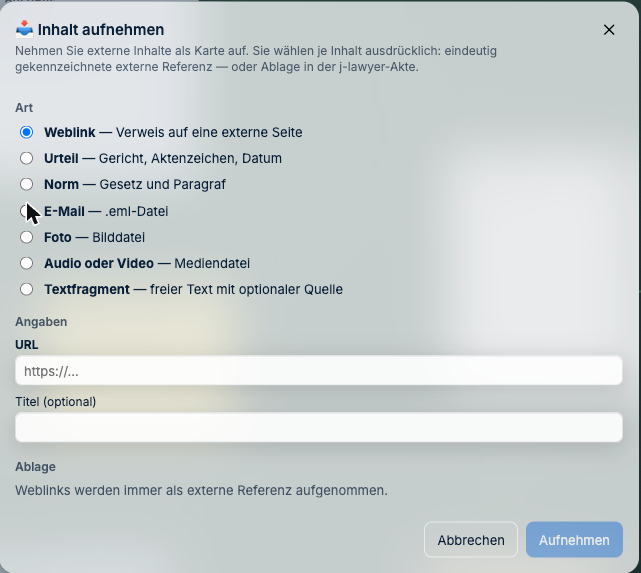
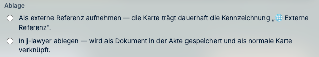
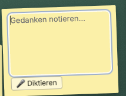

# Post und Dokumente

*Wie Sachen in die Akte kommen.*

---

## Wie bekomme ich ein Dokument auf den Tisch?

Die Dokumente der Akte sind bereits da — sie kommen aus j-lawyer. Sie müssen nichts
hochladen, was dort schon liegt. Liegt ein Dokument noch nicht auf dem Tisch, holen Sie es
über die Dokumentliste der Akte dazu. Es entsteht dabei **keine Kopie**: Die Karte verweist
auf das Dokument in j-lawyer.

**So geht's:**

1. Oben links auf das **Aktenzeichen** klicken — das öffnet das Schreibtisch-Menü.
2. **„Hinzufügen"** in der oberen Leiste → **„Datei…"** für etwas vom eigenen Rechner.

---

## Wie nehme ich etwas Neues auf?

Manches gehört in die Akte, kommt aber nicht als Dokument aus j-lawyer — ein Urteil, eine
Norm, eine E-Mail, ein Foto vom Ortstermin. Dafür gibt es die Aufnahme. Sie entscheiden
dabei bei jedem Inhalt ausdrücklich, ob er in j-lawyer abgelegt wird oder nur als Verweis
vermerkt bleibt.

**So geht's:**

1. Oben links auf das **Aktenzeichen** klicken.
2. **„Inhalt aufnehmen…"** wählen.
3. Oben die **Art** ankreuzen, darunter die Angaben ausfüllen.
4. Unter **„Ablage"** entscheiden, wohin der Inhalt gehört.
5. **„Aufnehmen"**.

| Art | Wofür |
|---|---|
| **Weblink** | Eine Fundstelle im Netz |
| **Urteil** | Mit Gericht, Aktenzeichen und Datum |
| **Norm** | Mit Gesetz und Paragraf |
| **E-Mail** | Eine `.eml`-Datei |
| **Foto** | Vom Handy oder aus dem Dateisystem |
| **Audio oder Video** | Aufnahmen |
| **Textfragment** | Ein Stück Text, mit oder ohne Quelle |

---

## Was bedeutet „Ablage"?

Das ist die wichtigste Entscheidung beim Aufnehmen, und sie betrifft die Akte: Entweder der
Inhalt wird **in j-lawyer gespeichert** und ist damit Teil der Akte — oder er bleibt eine
**externe Referenz**, also ein dauerhaft gekennzeichneter Verweis auf etwas, das anderswo
liegt.

> **Wichtig für die Akte:** Ein Weblink kann sich ändern oder verschwinden — deshalb werden
> Weblinks **immer** als externe Referenz aufgenommen, nie kopiert. Ist der Inhalt
> beweiserheblich, laden Sie ihn als Datei herunter und legen Sie ihn in j-lawyer ab,
> statt nur zu verlinken.

---

## Kann ich etwas mit dem Handy fotografieren?

Ja. Melden Sie sich am Smartphone an derselben Adresse an. Sie bekommen dort **nicht** den
vollen Schreibtisch — das wäre auf einem kleinen Bildschirm unbrauchbar —, sondern einen
Schnellzugriff mit dem, was unterwegs Sinn ergibt:

- **fotografieren und hochladen** (Posteingang, Beweisstücke, Vor-Ort-Aufnahmen)
- **diktieren**
- **Aufgaben abhaken**

Das Foto landet in der Akte und liegt beim nächsten Öffnen am Rechner auf dem Tisch.

---

## Kann ich diktieren statt tippen?

Ja. Jeder Zettel und jede Objektkarte hat im Bearbeitungsmodus einen **Diktieren**-Knopf.
Das ist vor allem dann schneller, wenn Sie ohnehin gerade das Diktiergerät in der Hand
haben.

**So geht's:**

1. Zettel oder Karte **doppelklicken** — sie geht in den Bearbeitungsmodus.
2. Auf **„🎤 Diktieren"** klicken und sprechen.
3. Mit **Cmd+Enter** (bzw. Strg+Enter) oder einem Klick daneben übernehmen.

**Für die Verschwiegenheit wichtig:** Die Aufnahme geht an den Server Ihrer Kanzlei, der
sie zur Umwandlung in Text weiterreicht. Sie wird **nirgends abgelegt**.

---

## Wie finde ich etwas in einem gescannten Dokument?

J-DESK liest gescannte Seiten automatisch mit Texterkennung (**OCR, deutsch**). Danach
finden Sie auch darin über die Suche.

Die Erkennungsqualität wird angezeigt. Das ist kein Beiwerk: Bei einem schlechten Scan
kann die Erkennung Wörter verfehlen. Wenn ein Treffer wichtig ist, prüfen Sie ihn am
Original.

---

## Was bedeuten die Zustände an einer Karte?

Karten zeigen an, wie es ihrem Dokument in j-lawyer geht:

| Anzeige | Bedeutung | Was Sie tun |
|---|---|---|
| *(nichts)* | Alles in Ordnung | — |
| **ersetzt** | In j-lawyer liegt eine neuere Fassung | Prüfen, ob Ihre Fundstellen noch passen |
| **umbenannt** | Nur der Name hat sich geändert | Nichts |
| **nicht erreichbar** | j-lawyer antwortet gerade nicht | Später nochmal; Ihre Arbeit bleibt |
| **gelöscht** | In j-lawyer entfernt | Rücksprache mit der Sachbearbeitung |
| **Berechtigung entzogen** | Sie dürfen es nicht mehr sehen | Bei der Technik nachfragen |
| **archiviert** | In j-lawyer archiviert | Meist unkritisch |

**In allen Fällen gilt:** Ihre Annotationen, Verknüpfungen und Notizen **bleiben erhalten**.
Es verschwindet nichts kommentarlos.

---

**Weiter:** [Anlagen zusammenstellen](03-anlagenpaket.md) ·
*Zurück zur [Schnellhilfe](README.md)*
