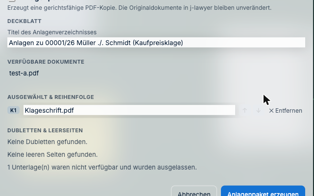

# Anlagen zusammenstellen

*Auch bekannt als: Anlagenkonvolut, Anlagenpaket, „die K1, K2, K3 machen", Anlagenband.*

Das ist die Arbeit, die früher Stunden gekostet hat: Dokumente in die richtige Reihenfolge
bringen, durchnummerieren, Deckblatt tippen, Seitenzahlen vergeben, Inhaltsverzeichnis
schreiben — und beim kleinsten Nachtrag von vorne anfangen.

In J-DESK sind es zwei Schritte.

---

## Wie stelle ich die Anlagen für einen Schriftsatz zusammen?

### Schritt 1: Dokumente freigeben

**Das ist der Schritt, der am häufigsten für Verwirrung sorgt** — bitte einmal in Ruhe
lesen, dann ist es für immer klar.

Ein Dokument muss **für den Export freigegeben** sein, bevor es in ein Anlagenpaket darf.
Von sich aus ist alles *intern* — das ist die Sicherung dagegen, dass versehentlich etwas
nach außen gelangt.

**Rechtsklick auf das Dokument → „Freigabe" → exportierbar**

> ### „Ich sehe den Menüpunkt gar nicht!"
>
> Wenn im Rechtsklick-Menü **„Zu Anlagenpaket hinzufügen" fehlt**, ist das Dokument noch
> nicht freigegeben. Der Punkt wird dann bewusst gar nicht erst angezeigt — statt ihn
> anzubieten und die Aktion hinterher abzulehnen.
>
> **Lösung:** erst die Freigabe auf *exportierbar* setzen (siehe oben), danach erscheint
> der Menüpunkt.

### Schritt 2: Dokumente auswählen

Für jedes freigegebene Dokument, das ins Paket soll:

**Rechtsklick → „Zu Anlagenpaket hinzufügen"**

Sie können das nach und nach tun, während Sie die Akte durchgehen.

> **Abkürzung:** Liegt schon ein Stapel mit den richtigen Dokumenten, geht auch
> **Rechtsklick auf den Stapel → „Anlagenpaket aus Stapel…"**.

### Schritt 3: Paket erstellen

Der Dialog öffnet sich **beim ersten Hinzufügen von selbst**. Später erreichen Sie ihn
jederzeit wieder über **Schreibtisch-Menü → „Anlagenpaket…"**.

> **Lesen Sie die Zeile unter „Dubletten & Leerseiten".** Steht dort „*n* Unterlage(n)
> waren nicht verfügbar und wurden ausgelassen", fehlt im Paket etwas — in aller Regel,
> weil bei diesen Dokumenten die Freigabe auf *exportierbar* noch fehlt. Das Paket wird
> trotzdem erzeugt, nur eben ohne diese Anlagen.

Vier Bereiche:

| Bereich | Was Sie dort tun |
|---|---|
| **Deckblatt** | Titel des Anlagenverzeichnisses — ist mit dem Aktenzeichen **vorbefüllt** |
| **Verfügbare Dokumente** | Was noch dazukommen könnte, per Klick |
| **Ausgewählt & Reihenfolge** | Reihenfolge mit den Pfeilen ändern — **das ist die Anlagennummerierung**. Die Kennzeichnung K1, K2 … vergibt J-DESK dabei selbst |
| **Dubletten & Leerseiten** | Prüfergebnis, siehe unten |

Reihenfolge stimmt? Dann **„Anlagenpaket erzeugen"**. Fertig.

> **„1 Unterlage(n) waren nicht verfügbar und wurden ausgelassen"** — diese Meldung
> bedeutet, dass ein Dokument nicht aus j-lawyer geladen werden konnte. Prüfen Sie, ob es
> ins Paket gehört; siehe [Wenn etwas fehlt](06-wenn-etwas-fehlt.md).

---

## Was macht J-DESK automatisch?

Alles, was sonst Handarbeit ist:

- **Deckblatt**
- **Anlagennummern** — K1, K2, K3 … in der Reihenfolge, die Sie festgelegt haben
- **Durchgehende Seitennummerierung** über alle Anlagen hinweg
- **Inhaltsverzeichnis**
- **PDF-Lesezeichen**, damit man im fertigen Dokument springen kann

Ändert sich die Reihenfolge, ändert sich alles mit. Sie müssen nichts nachziehen.

---

## Was ist mit Dubletten und leeren Seiten?

J-DESK prüft das Paket, bevor es erstellt wird, und meldet:

- **Dubletten** — dasselbe Dokument versehentlich zweimal drin
- **Leere Seiten** — typische Rückseiten aus dem Scanner

Leere Seiten können Sie entfernen lassen. Dubletten zeigt J-DESK an, damit Sie
entscheiden — manchmal *soll* ein Dokument zweimal vorkommen.

Findet die Prüfung nichts, steht dort **„Keine Dubletten gefunden."** und
**„Keine leeren Seiten gefunden."**

---

## Werden meine Originale verändert?

**Nein.** Die Originale bleiben unangetastet. Das Anlagenpaket ist ein neues Dokument, das
zusätzlich entsteht. In j-lawyer wird nichts überschrieben und nichts gelöscht.

---

## Kommen meine internen Notizen mit ins Paket?

**Nein** — jedenfalls nicht, solange sie intern sind, und das sind sie von sich aus.

J-DESK unterscheidet drei Stufen: *intern*, *mandantensichtbar* und *exportierbar*. Was
nicht ausdrücklich für den Export freigegeben wurde, **gilt als intern** und bleibt
draußen.

> **Trotzdem gilt:** Sehen Sie das fertige Paket vor dem Versand einmal durch. Wenn jemand
> eine Notiz bewusst auf „exportierbar" gestellt hat, tut J-DESK, was ihm gesagt wurde.
>
> Ausführlich: [Vertraulichkeit](../anwalt/06-vertraulichkeit.md)

---

## Muss etwas geschwärzt werden?

Wenn im Paket Stellen unkenntlich sein sollen (Kontonummern, Namen Dritter,
Gesundheitsdaten), lassen Sie sie **vor** dem Erstellen schwärzen.

J-DESK **entfernt** den geschwärzten Text aus der Datei — er wird nicht nur schwarz
übermalt. Ein übermalter Text ließe sich mit Kopieren-und-Einfügen wieder sichtbar machen;
das ist der Fehler, der schon Kanzleien in die Zeitung gebracht hat.

Nach dem Schwärzen prüft J-DESK die erzeugte Datei noch einmal nach und **bricht ab**,
wenn doch noch Text gefunden wird.

---

## Was gibt es noch für Übergabeformate?

Über **Schreibtisch-Menü → „Übergabe…"** stehen weitere Zusammenstellungen bereit:

- **Schreibtisch-Momentaufnahme** — wie die Akte gerade aussieht
- **Argumentationsübersicht** — welche Behauptung worauf gestützt ist
- **Beweismittelübersicht**
- **Aufgabenliste**

Praktisch, wenn eine Kollegin das Mandat übernimmt oder für die Besprechung mit der
Mandantschaft.

---

**Weiter:** [Aufgaben und Fristen](04-aufgaben-und-fristen.md) ·
*Zurück zur [Schnellhilfe](README.md)*
