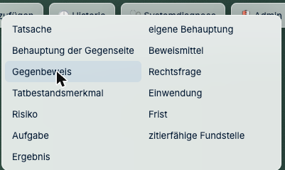
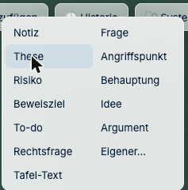
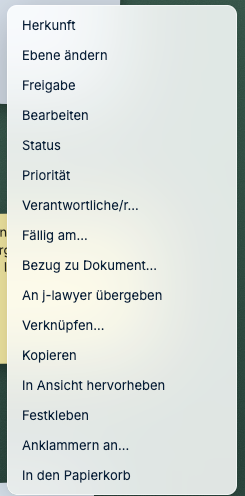
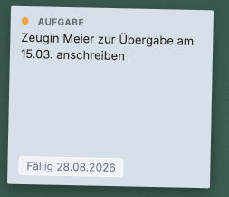
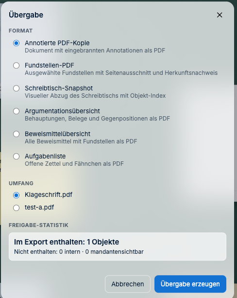

# Aufgaben und Fristen

*Auch bekannt als: Wiedervorlage, Fristenkontrolle, To-do, „wer macht was bis wann".*

---

## Vorab: Was gehört in j-lawyer, was in J-DESK?

Das ist die wichtigste Frage in diesem Kapitel — bitte einmal in der Kanzlei klären.

| | j-lawyer | J-DESK |
|---|---|---|
| **Echte Fristen** (Notfrist, Berufungsfrist) | **Ja, hier hin.** Der Fristenkalender ist und bleibt das führende System | nur als Arbeitsvermerk |
| **Arbeitsschritte an der Akte** („Zeugin anschreiben", „Anlage prüfen") | möglich | **hier praktischer** — direkt an der Stelle, an der die Arbeit anfällt |

**Faustregel:** Was haftungsrelevant ist, gehört in den Fristenkalender von j-lawyer.
J-DESK ersetzt ihn nicht. Was Sie in J-DESK anlegen, können Sie aber **an j-lawyer
übergeben** — siehe unten.

---

## Wie lege ich eine Aufgabe an?

Eine Aufgabe ist eine Karte wie jede andere und liegt dort, wo die Arbeit anfällt — gern
direkt neben dem Dokument, um das es geht. Das ist der eigentliche Gewinn gegenüber einer
Liste: Sie sehen die Aufgabe, wenn Sie die Akte ansehen.

**So geht's:**

1. In der oberen Leiste auf **„+ Hinzufügen"** klicken.
2. **„Juristisches Objekt…"** wählen.
3. **„Aufgabe"** anklicken — die Karte erscheint auf dem Tisch.
4. Karte **doppelklicken**, Text eingeben, mit **Cmd+Enter** (bzw. Strg+Enter) übernehmen.
5. Karte an die Stelle ziehen, an die sie gehört.

> **„Aufgabe" oder „Frist"?** In derselben Liste steht auch **Frist** als eigene Art. Die
> Aufgabe beschreibt einen Arbeitsschritt, die Frist einen Termin, der einzuhalten ist.
> Für haftungsrelevante Fristen bleibt trotzdem der Kalender in j-lawyer maßgeblich.

### Nicht verwechseln: der To-do-Zettel

Unter **„+ Hinzufügen" → „Zettel…"** gibt es ebenfalls ein **To-do**. Das ist ein
Notizzettel mit passender Beschriftung — ein Merkposten für Sie selbst.

| | To-do-Zettel | Aufgabenkarte |
|---|---|---|
| Fälligkeit, Verantwortung, Priorität, Status | nein | **ja** |
| An j-lawyer übergebbar | nein | **ja** |
| Steht in der Aufgabenliste | ja, solange nicht abgehakt | **ja**, solange offen |

**Faustregel:** Alles, was jemand anderes erledigen soll oder wozu ein Datum gehört, wird
eine **Aufgabe**. Ein Merkposten für Sie selbst reicht als Zettel.

---

## Wie ergänze ich Fälligkeit, Verantwortung und Priorität?

Alles Weitere hängt am **Rechtsklick auf die Aufgabenkarte**. Dort finden Sie auch alles,
was die Aufgabe mit der Akte verbindet.

| Menüpunkt | Wofür |
|---|---|
| **Fällig am…** | Datum im Format `TT.MM.JJJJ` eintragen |
| **Verantwortliche/r…** | Wer erledigt es |
| **Priorität** | hoch · mittel · niedrig |
| **Status** | offen · in Arbeit · erledigt · übergeben |
| **Bezug zu Dokument…** | Verbindung zur Fundstelle, um die es geht |
| **An j-lawyer übergeben** | siehe unten |

Die Fälligkeit steht danach unten auf der Karte — sichtbar, ohne dass man sie aufklappen
muss.

---

## Wie weise ich eine Aufgabe zu?

**Rechtsklick auf die Aufgabe → „Verantwortliche/r…"**

Die betroffene Person bekommt eine Benachrichtigung. J-DESK benachrichtigt bewusst nur bei
Relevantem — Erwähnungen, Aufgabenänderungen, ersetzte Dokumente, wartende KI-Freigaben,
verlorene Quellen. **Nicht** bei jeder Kartenbewegung.

---

## Wie übergebe ich eine Aufgabe an j-lawyer?

Wenn aus dem Arbeitsschritt eine echte Wiedervorlage werden soll, geben Sie die Aufgabe an
j-lawyer ab. Verantwortliche Person, Fälligkeit und der Bezug zum Dokument gehen dabei mit.

**So geht's:**

1. **Rechtsklick auf die Aufgabe → „An j-lawyer übergeben"**.
2. Die Rückfrage bestätigen.

Danach steht der Status auf **übergeben**. Von da an ist j-lawyer zuständig — die Aufgabe
in J-DESK bleibt als Vermerk stehen, damit auf dem Schreibtisch nachvollziehbar ist, was
mit ihr geschehen ist.

> **Nicht doppelt führen.** Eine Aufgabe an zwei Stellen mit zwei Ständen ist schlimmer als
> an einer. Nach der Übergabe pflegen Sie sie in j-lawyer weiter. Wurde eine Aufgabe schon
> einmal übergeben, weist die Rückfrage ausdrücklich darauf hin — so entsteht keine zweite
> Wiedervorlage aus Versehen.

---

## Wie behalte ich den Überblick?

**Was steht noch offen?** Es gibt eine Aufgabenliste als PDF — praktisch für die
Wochenbesprechung oder die Übergabe an eine Kollegin.

**So geht's:**

1. Oben links auf das **Aktenzeichen** klicken.
2. **„Übergabe…"** wählen.
3. Als Format **„Aufgabenliste"** ankreuzen.
4. **„Übergabe erzeugen"**.

Unten steht die **Freigabe-Statistik**: wie viele Objekte im Export enthalten sind und wie
viele nicht — getrennt nach *intern* und *mandantensichtbar*. Ein Blick darauf lohnt sich
immer, bevor etwas das Haus verlässt.

**Wo ist die Aufgabe zu diesem Dokument?** Rechtsklick auf die Aufgabe → **„Zum Bezug
springen"** führt Sie zum verknüpften Dokument. Und umgekehrt: von der Fundstelle zur
Aufgabe.

**Was hat sich getan?** Die **Historie** in der oberen Leiste zeigt, wer wann was geändert
hat.

---

## Bekomme ich eine Erinnerung?

J-DESK zeigt Fälligkeiten an der Karte und benachrichtigt bei Änderungen an Aufgaben, für
die Sie verantwortlich sind.

**Es ist aber kein Fristenkalender** und schickt keine Mahnungen mit Vorlauf. Für echte
Fristen bleibt der Fristenkalender von j-lawyer zuständig — siehe oben.

---

## Ich habe eine Aufgabe erledigt

**Rechtsklick → „Status" → erledigt.**

Sie verschwindet nicht, sondern bleibt sichtbar abgehakt. In einer Akte
ist es oft wichtiger, zu sehen, *dass* etwas erledigt wurde, als nur, was noch offen ist.

Wenn die Karte stört, legen Sie sie in den Papierkorb — dort ist sie wiederherstellbar,
und in j-lawyer ändert sich dadurch nichts.

---

**Weiter:** [Ordnung halten](05-ordnung-halten.md) ·
*Zurück zur [Schnellhilfe](README.md)*
