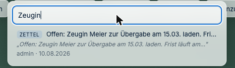

# Ordnung halten und wiederfinden

*Wenn auf dem Tisch alles durcheinanderliegt.*

---

## Wie stapele ich Dokumente?

Ziehen Sie eine Karte auf eine andere — sie liegen aufeinander wie ein Stapel Papier.

| Was Sie wollen | Rechtsklick auf den Stapel |
|---|---|
| Sehen, was drin ist | **Auffächern** |
| Einzelnes herausziehen | **Entfernen** aus dem Stapel |
| Stapel benennen | **Benennen…** |
| Wieder alles einzeln | **Stapel auflösen** |
| Zuklappen | **Zuklappen** |

Ein benannter Stapel („Korrespondenz 2025", „Anlagen Gegenseite") ist übersichtlicher als
zwanzig einzelne Karten.

---

## Was ist der Unterschied zwischen Heften, Klammern und Festkleben?

Drei Arten, Dinge zusammenzuhalten — wie im echten Büro:

| Menüpunkt | Bedeutung | Wieder lösen mit |
|---|---|---|
| **Heften** | fest verbunden, wie getackert | **Entheften** |
| **Anklammern an…** | lose verbunden, wie mit Büroklammer | **Klammer entfernen** |
| **Festkleben** | Karte bleibt an ihrer Stelle liegen, verrutscht nicht mehr | **Band abziehen** |

**Festkleben** ist besonders praktisch vor einem Termin: Was sitzt, verrutscht nicht mehr
versehentlich beim Verschieben.

---

## Der Tisch ist ein Chaos — kann ich aufräumen lassen?

**Schreibtisch-Menü → „Schreibtisch aufräumen…"**

J-DESK schaut sich den Tisch an und schlägt vor: ausrichten, sortieren, gruppieren,
Dubletten zusammenlegen, unverbundene Notizen sammeln.

> **Wichtig, und bewusst so gebaut:** Aufräumen zeigt **immer erst eine Vorschau**. Sie
> sehen, was geschehen *würde*, und entscheiden. Es passiert nie automatisch etwas, das Sie
> nicht angesehen haben.

Wenn Ihnen ein Vorschlag nicht gefällt, lehnen Sie ihn ab — der Rest wird trotzdem
ausgeführt.

---

## Wie finde ich etwas wieder?

Die Suche findet **alles auf einmal**:

- Dokumenttitel und **Inhalt der Dokumente** (auch in gescannten, per Texterkennung)
- Ihre Notizen, Markierungen, Stempeltexte, Ausschnitte
- Verknüpfungsarten, wer etwas angelegt hat, Datum

**Das Besondere:** Treffer erscheinen nicht nur als Liste, sondern **leuchten auf dem
Tisch auf** — Sie sehen sofort, wo in der Akte die Sache steckt.

> **Bekannte Einschränkung (Stand 10.08.2026):** Die Suche findet Dokumente, Notizzettel,
> Markierungen, Stempel und Ausschnitte — **nicht** aber den Text juristischer Objekte
> (Behauptungen, Tatsachen, Beweismittel) und nicht Tabellentitel. Wenn Sie eine
> Behauptung suchen, gehen Sie über die [Auswertung](../anwalt/04-luecken-finden.md) oder
> die Minikarte. Der Fehler ist gemeldet.

Die Suche zeigt Ihnen nur, was Sie sehen dürfen. Aus Bereichen ohne Ihre Berechtigung gibt
es keine Treffer.

---

## Ich habe mich verlaufen

| Hilfe | Wo |
|---|---|
| **Minikarte** | Obere Leiste — zeigt den ganzen Tisch im Kleinen |
| **„Zurück zur letzten Position"** | Befehlsliste |
| **Ansichten** | Gespeicherte Blickwinkel, siehe unten |
| **Zonen** | Benannte Bereiche auf dem Tisch |

---

## Kann ich mir einen Blick merken?

Ja — das sind **Ansichten**.

Sie richten den Tisch so ein, wie Sie ihn brauchen („nur was den Verzug betrifft"), und
speichern das über **Ansichten → Ansicht speichern…**. Gemerkt werden Position, Zoom,
sichtbare Ebenen, Filter und geöffnete Dokumente.

Später kehren Sie mit einem Klick dorthin zurück. Sinnvolle Ansichten:
„Termin am 3.9.", „Was noch offen ist", „Nur die Anlagen".

---

## Wozu sind Zonen gut?

Über die Befehlsliste → **„Zone anlegen…"** markieren Sie einen benannten Bereich auf dem
Tisch: „Klägerseite", „Beklagtenseite", „noch zu prüfen".

Wie Ablagekörbe auf einem echten Schreibtisch — man legt Dinge hinein und weiß, was sie
dort bedeuten.

---

## Ich brauche eine Vorlage für einen neuen Fall

**Schreibtisch-Menü → „Neu aus Vorlage…"**

Es gibt vorbereitete Anordnungen für gängige Mandatstypen (etwa Kündigungsschutz,
Strafverfahren, Vertragsprüfung) mit passenden Bereichen und Objekttypen. Spart das
Einrichten bei jedem neuen Mandat.

---

**Weiter:** [Wenn etwas fehlt](06-wenn-etwas-fehlt.md) ·
*Zurück zur [Schnellhilfe](README.md)*
