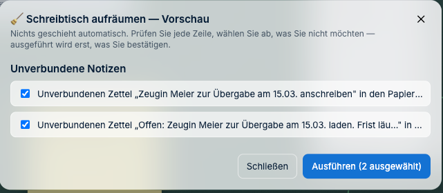
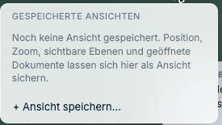

# Ordnung halten und wiederfinden

*Wenn auf dem Tisch alles durcheinanderliegt.*

---

## Wie stapele ich Dokumente?

Ziehen Sie eine Karte auf eine andere — sie liegen aufeinander wie ein Stapel Papier.

| Was Sie wollen | Rechtsklick auf den Stapel |
|---|---|
| Sehen, was drin ist | **Auffächern** |
| Einzelnes herausziehen | **Entfernen** aus dem Stapel |
| Stapel benennen | **Benennen…** |
| Wieder alles einzeln | **Stapel auflösen** |
| Zuklappen | **Zuklappen** |

Ein benannter Stapel („Korrespondenz 2025", „Anlagen Gegenseite") ist übersichtlicher als
zwanzig einzelne Karten.

---

## Was ist der Unterschied zwischen Heften, Klammern und Festkleben?

Drei Arten, Dinge zusammenzuhalten — wie im echten Büro:

| Menüpunkt | Bedeutung | Wieder lösen mit |
|---|---|---|
| **Heften** | fest verbunden, wie getackert | **Entheften** |
| **Anklammern an…** | lose verbunden, wie mit Büroklammer | **Klammer entfernen** |
| **Festkleben** | Karte bleibt an ihrer Stelle liegen, verrutscht nicht mehr | **Band abziehen** |

**Festkleben** ist besonders praktisch vor einem Termin: Was sitzt, verrutscht nicht mehr
versehentlich beim Verschieben.

---

## Der Tisch ist ein Chaos — kann ich aufräumen lassen?

Ja. J-DESK schaut sich den Tisch an und schlägt vor, was sich ordnen ließe: ausrichten,
sortieren, gruppieren, Dubletten zusammenlegen, unverbundene Notizen sammeln. Ausgeführt
wird nur, was Sie ausdrücklich stehen lassen.

**So geht's:**

1. Oben links auf das **Aktenzeichen** klicken.
2. **„Schreibtisch aufräumen…"** wählen.
3. Die Vorschau durchgehen und **abwählen**, was nicht geschehen soll.
4. **„Ausführen"** — die Zahl im Knopf sagt, wie viele Vorschläge übrig sind.

> **Nichts geschieht automatisch.** Aufräumen zeigt immer erst die Vorschau. Wenn Ihnen ein
> Vorschlag nicht gefällt, nehmen Sie den Haken heraus — der Rest wird trotzdem ausgeführt.
> Und was doch zu viel war, liegt im Papierkorb und lässt sich zurückholen.

---

## Wie finde ich etwas wieder?

Die Suche findet **alles auf einmal**:

- Dokumenttitel und **Inhalt der Dokumente** (auch in gescannten, per Texterkennung)
- Ihre Notizen, Markierungen, Stempeltexte, Ausschnitte
- Verknüpfungsarten, wer etwas angelegt hat, Datum

**Das Besondere:** Treffer erscheinen nicht nur als Liste, sondern **leuchten auf dem
Tisch auf** — Sie sehen sofort, wo in der Akte die Sache steckt.

Gefunden werden Dokumente, Notizzettel, Markierungen, Stempel, Ausschnitte, Verknüpfungen,
Zeitleisten, Tabellen — und der Text juristischer Objekte, also Ihre Behauptungen,
Tatsachen und Beweismittel. Jeder Treffer trägt ein Kennzeichen, das zeigt, worum es sich
handelt (*Karte*, *Zettel*, *Objekt*, *Tabelle* …).

Die Suche zeigt Ihnen nur, was Sie sehen dürfen. Aus Bereichen ohne Ihre Berechtigung gibt
es keine Treffer.

---

## Ich habe mich verlaufen

| Hilfe | Wo |
|---|---|
| **Minikarte** | Obere Leiste — zeigt den ganzen Tisch im Kleinen |
| **„Zurück zur letzten Position"** | Befehlsliste |
| **Ansichten** | Gespeicherte Blickwinkel, siehe unten |
| **Zonen** | Benannte Bereiche auf dem Tisch |

---

## Kann ich mir einen Blick merken?

Ja — das sind **Ansichten**. Wenn Sie den Tisch einmal so eingerichtet haben, wie Sie ihn
für eine bestimmte Arbeit brauchen („nur was den Verzug betrifft"), speichern Sie diesen
Blick und kehren später mit einem Klick dorthin zurück.

**So geht's:**

1. Den Tisch so einrichten, wie Sie ihn brauchen.
2. In der oberen Leiste auf **„Ansichten"** klicken.
3. **„+ Ansicht speichern…"** wählen und einen Namen vergeben.

Gemerkt werden Position, Zoom, sichtbare Ebenen und geöffnete Dokumente. Sinnvolle
Ansichten: „Termin am 3.9.", „Was noch offen ist", „Nur die Anlagen".

---

## Wozu sind Zonen gut?

Zonen sind benannte Bereiche auf dem Tisch — „Klägerseite", „Beklagtenseite", „noch zu
prüfen". Wie Ablagekörbe auf einem echten Schreibtisch: Man legt Dinge hinein und weiß,
was sie dort bedeuten.

**So geht's:** Befehlsliste öffnen (Schreibtisch-Menü → **„Befehle…"**) und **„Zone
anlegen…"** wählen.

> **Zonen anlegen darf, wer den Schreibtisch verwaltet.** Fehlt Ihnen der Eintrag, ist das
> kein Fehler — fragen Sie, wer den Schreibtisch besitzt.

---

**Weiter:** [Wenn etwas fehlt](06-wenn-etwas-fehlt.md) ·
*Zurück zur [Schnellhilfe](README.md)*
