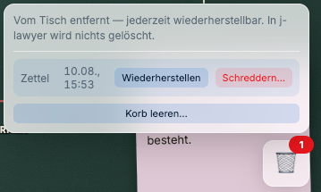
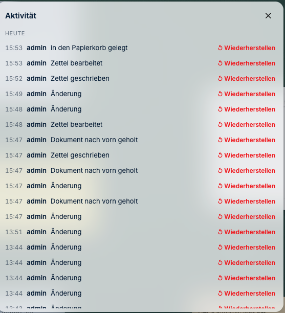
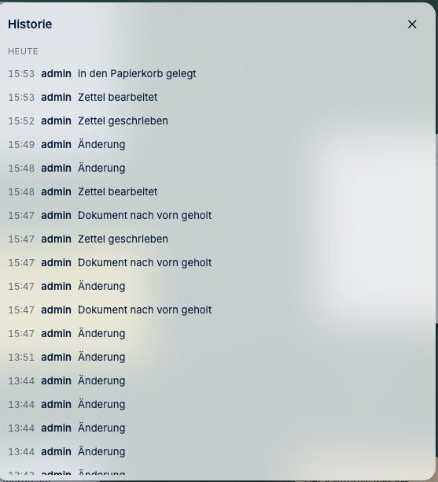

# Wenn etwas fehlt oder klemmt

*Die üblichen Stolpersteine — und warum die meisten harmloser sind, als sie aussehen.*

---

## Ich habe aus Versehen etwas gelöscht

**Ruhig bleiben. Es ist fast sicher noch da.**

J-DESK unterscheidet drei Stufen, und nur die dritte ist endgültig:

| Was Sie getan haben | Was passiert ist | Rückholbar? |
|---|---|---|
| **Vom Tisch entfernt** | Die Karte liegt nicht mehr auf dem Schreibtisch | **Ja** |
| **In den Papierkorb** | Liegt im Papierkorb | **Ja** — Papierkorb öffnen, zurückholen |
| **Geschreddert** | Endgültig gelöscht | **Nein** — deshalb wird ausdrücklich gefragt |

**Und in jedem Fall:** In j-lawyer wird **nichts** gelöscht. Das Originaldokument ist
unberührt, ganz gleich, was Sie in J-DESK tun.

**So holen Sie etwas zurück:**

1. Auf das **Papierkorb-Symbol unten rechts** klicken. Die Zahl daran zeigt, wie viel darin
   liegt.
2. Beim gesuchten Eintrag auf **„Wiederherstellen"** klicken — die Karte liegt wieder auf
   dem Tisch.

> **„Schreddern…" und „Korb leeren…" sind endgültig.** Beides fragt ausdrücklich nach,
> bevor es ausgeführt wird. Auch danach bleibt das Original in j-lawyer unberührt —
> endgültig weg ist nur, was Sie in J-DESK daran gearbeitet haben.

---

## Ich finde einen früheren Stand nicht mehr

Der ganze Schreibtisch lässt sich auf einen früheren Stand zurücksetzen — nicht nur eine
einzelne Karte. Das ist der Ausweg, wenn beim Aufräumen zu viel verschoben wurde oder eine
Änderung sich als Irrweg herausstellt.

**So geht's:**

1. Oben links auf das **Aktenzeichen** klicken.
2. **„Aktivität…"** wählen.
3. Bei dem Zeitpunkt, auf den Sie zurückwollen, auf **„↺ Wiederherstellen"** klicken.
4. Die Rückfrage bestätigen.

Der aktuelle Stand wird dabei automatisch gesichert und bleibt seinerseits
wiederherstellbar. Es geht also nichts verloren, wenn Sie sich anders entscheiden. Alle
verbundenen Kolleginnen sehen die Änderung sofort.

> **Historie oder Aktivität?** Die **Historie** in der oberen Leiste zeigt dieselben
> Vorgänge, aber nur zum Nachlesen. Zurücksetzen können Sie ausschließlich über
> **„Aktivität…"** — und nur, wenn Sie den Schreibtisch verwalten dürfen.

---

## „Quelldokument derzeit nicht verfügbar"

Das Dokument liegt gerade nicht abrufbar in j-lawyer. Mögliche Gründe: j-lawyer ist nicht
erreichbar, das Dokument wurde verschoben, umbenannt oder archiviert.

**Ihre Arbeit ist nicht weg.** Alle Verknüpfungen, Notizen und Markierungen bleiben
erhalten. Nur der Blick ins Dokument fehlt vorübergehend.

Was tun: später erneut versuchen. Bleibt es dabei, bei der Technikbetreuung nachfragen —
für die gibt es dazu die [Störungssuche](../technik/05-stoerungssuche.md).

---

## Ich sehe ein Dokument nicht, die Kollegin schon

Das ist eine Berechtigungsfrage und meistens richtig so — J-DESK zeigt jedem nur das, was
er sehen darf.

Zwei mögliche Ursachen:

1. **In j-lawyer** haben Sie für dieses Dokument keine Berechtigung. Dann muss sie dort
   erteilt werden.
2. **In J-DESK** liegt der Inhalt auf einer Ebene, die für Sie nicht sichtbar ist — etwa
   auf der privaten Ebene einer Kollegin.

Wer den Schreibtisch besitzt, kann das nachsehen: **Rechtsklick auf die Karte →
„Sichtbarkeit prüfen…"** zeigt für eine ausgewählte Person, was sie sieht und warum.

---

## Die Seite lädt nicht / ich komme nicht rein

Der Reihe nach:

1. **Seite neu laden** (F5 oder Strg+R / Cmd+R)
2. **Können Sie sich bei j-lawyer anmelden?** Wenn nein, liegt es am Zugang, nicht an
   J-DESK
3. **Kommen Kolleginnen rein?** Wenn niemand reinkommt, ist der Server betroffen — dann
   die Technikbetreuung informieren

Für die Technik: [Störungssuche](../technik/05-stoerungssuche.md).

---

## Ich habe etwas verschoben und finde es nicht wieder

- **Minikarte** einblenden — zeigt den ganzen Tisch
- **Suche** benutzen — Treffer leuchten auf dem Tisch auf
- **„Zurück zur letzten Position"** in der Befehlsliste

---

## Zwei von uns haben gleichzeitig gearbeitet

Das ist vorgesehen. Sie sehen, wer gerade mitarbeitet und woran.

Haben Sie **dieselbe** Sache gleichzeitig geändert, fragt J-DESK nach, welche Fassung
gelten soll. Es wird nie stillschweigend eine Version verworfen — gerade bei Fristen und
Status wäre das gefährlich.

Wählen Sie im Zweifel „Beides behalten" und klären es anschließend mit der Kollegin.

---

## Ich war offline

Kein Problem. Ihre Änderungen werden lokal gepuffert und nach der Wiederverbindung
nachgespielt. Das funktioniert auch, wenn zwischendurch der Rechner neu gestartet wurde.

---

## Etwas anderes stimmt nicht

In der oberen Leiste gibt es die **Systemdiagnose**. Sie zeigt, ob Verbindungen stehen und
Sicherungen laufen, und lässt sich als Paket exportieren — praktisch, wenn Sie der
Technikbetreuung schildern sollen, was los ist.

> **Bevor Sie einen Screenshot verschicken:** Auf dem Bild stehen möglicherweise
> Aktenzeichen und Namen. Innerhalb der Kanzlei ist das unproblematisch — an Externe oder
> in ein öffentliches Fehlerverzeichnis gehören solche Angaben nicht.

---

**Zurück zur [Schnellhilfe](README.md)** ·
*[Handbuch-Übersicht](../README.md)*
