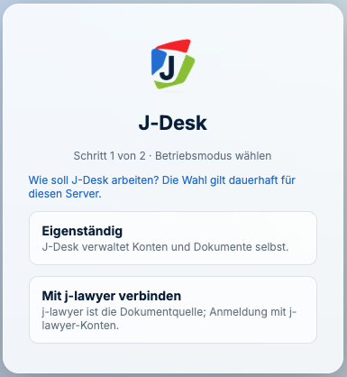
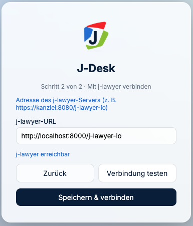
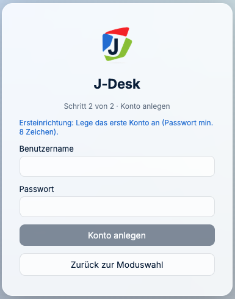

# Erste Einrichtung

*Nach der Installation: Was jetzt zu entscheiden und zu prüfen ist.*

---

## Die eine Entscheidung: Betriebsart

J-DESK läuft in zwei grundverschiedenen Betriebsarten. Der Unterschied ist **eine einzige
Einstellung** — aber er ändert alles, was Anwender erleben.

| | `JLAWYER_URL` **gesetzt** | `JLAWYER_URL` **leer** |
|---|---|---|
| Betriebsart | `jlawyer` | `standalone` |
| Anmeldung | mit j-lawyer-Zugangsdaten | eigenes Konto in J-DESK |
| Benutzerverwaltung | **entfällt** — kommt aus j-lawyer | in J-DESK selbst |
| Akten und Dokumente | aus j-lawyer | von Hand hochladen |
| Ersteinrichtungsmaske | **erscheint nicht** | erscheint beim ersten Aufruf |
| Geeignet für | **Kanzleibetrieb** | Ausprobieren, Schulung |

### Zwei Wege, das einzustellen

**Weg 1 — die Ersteinrichtungsmaske.** Starten Sie J-DESK ohne `JLAWYER_URL` und rufen die
Adresse im Browser auf, fragt J-DESK selbst nach der Betriebsart:



**Weg 2 — die Umgebungsvariable.** `JLAWYER_URL` in der `.env` setzen. Dann erscheint die
Maske gar nicht erst; die Betriebsart steht von Anfang an fest.

> **Welcher Weg gilt, wenn beides gesetzt ist?** Die **Umgebungsvariable gewinnt** immer.
> Sie können also eine über die Maske getroffene Wahl später mit `JLAWYER_URL` überstimmen.

> **Die Wahl in der Maske ist einmalig.** Ist sie einmal gespeichert, verschwindet die Maske;
> ein zweiter Versuch wird mit „Der Betriebsmodus ist bereits konfiguriert" abgewiesen. Für
> einen Wechsel danach führt der Weg über die Umgebungsvariable — Einstellung ändern und neu
> starten.

---

## Welche Betriebsart läuft gerade?

Eine Abfrage genügt:

```bash
curl -s http://localhost:4810/api/v1/auth/status
```

Antwort im j-lawyer-Betrieb:

```json
{"needsSetup":false,"mode":"jlawyer","needsModeChoice":false}
```

Antwort im eigenständigen Betrieb vor der Einrichtung:

```json
{"needsSetup":true,"mode":"standalone","needsModeChoice":true}
```

**Steht dort `standalone`, obwohl Sie j-lawyer angebunden haben,** ist `JLAWYER_URL` nicht
angekommen. Die zwei üblichen Ursachen: Nach dem Ändern der `.env` wurde
`docker compose up -d` nicht ausgeführt (ein bloßes `restart` liest die `.env` nicht neu),
oder die Variable steht in der falschen Datei.

---

## j-lawyer anbinden

```
JLAWYER_URL=http://kanzlei-server:8080/j-lawyer-io
```

**Drei Stolpersteine, in der Reihenfolge ihrer Häufigkeit:**

**1. `localhost` funktioniert im Container nicht.** Aus Sicht des Containers ist
`localhost` der Container selbst. Läuft j-lawyer auf demselben Rechner:

```
JLAWYER_URL=http://host.docker.internal:8080/j-lawyer-io
```

**2. Der Pfad `/j-lawyer-io` gehört dazu.** Ohne ihn wird die Schnittstelle nicht gefunden.

**3. Es ist der Port von j-lawyer**, nicht der von J-DESK.

### Anbindung prüfen

**Wenn Sie über die Maske einrichten,** nimmt J-DESK Ihnen die Prüfung ab: Adresse
eintragen, **„Verbindung testen"** drücken. Steht darunter **„j-lawyer erreichbar"**,
stimmt die Adresse — und erst dann lässt sich speichern.



**Wenn die Maske nicht mehr erscheint** — weil die Betriebsart bereits feststeht —, prüfen
Sie vom Container aus, nicht vom Server:

```bash
sudo docker compose exec j-desk node -e "fetch(process.env.JLAWYER_URL+'/v1/cases/list').then(r=>console.log('Antwort:',r.status)).catch(e=>console.log('Kein Kontakt:',e.message))"
```

**`Antwort: 401` ist das gewünschte Ergebnis.** Die Verbindung steht; 401 heißt lediglich
„ohne Anmeldung nicht erlaubt". Alles andere als eine HTTP-Antwort bedeutet, dass die
Adresse nicht stimmt.

### Versionsverträglichkeit

J-DESK prüft beim Anmelden, ob die j-lawyer-Version verträglich ist, und meldet
Inkompatibilitäten verständlich, statt stillschweigend zu scheitern. Bei erfolgreicher
Anmeldung erscheint der Vermerk `"jlVersion":"kompatibel"`.

---

## Erstes Konto im eigenständigen Betrieb

Wählen Sie in der Maske **„Eigenständig"**, folgt als Schritt 2 die Anlage des ersten
Kontos. Dieses hat Verwaltungsrechte. **Das Passwort muss mindestens acht Zeichen haben.**



Danach steht `"needsSetup":false`, und die Maske erscheint nicht mehr.

> **Nicht offen stehen lassen.** Solange die Ersteinrichtung nicht abgeschlossen ist, kann
> sie jeder ausfüllen, der die Adresse erreicht. Richten Sie das erste Konto direkt nach
> der Installation ein.

---

## Erreichbarkeit im Kanzleinetz

J-DESK hört auf Port 4810. Damit die Arbeitsplätze herankommen, muss der Port im
Kanzleinetz offen sein.

**Ins Internet gehört er nicht.** J-DESK ist für den Betrieb im eigenen Netz gedacht.

Soll von außen zugegriffen werden: über VPN, oder mit einem vorgeschalteten
Vermittlungsdienst mit gültigem Zertifikat (Caddy, nginx). Ohne Verschlüsselung haben
Mandatsdaten in fremden Netzen nichts verloren.

---

## Office-Vorschau (freiwillig)

Ohne sie zeigt J-DESK PDF- und Bilddateien direkt an; Word- und Excel-Dateien werden zum
Herunterladen angeboten. Für die Anzeige im Browser braucht es einen zusätzlichen Dienst.

**Bevor Sie das einschalten:** Der Dienst braucht etwa **2 Prozessorkerne und 4 GB
Arbeitsspeicher zusätzlich**. Auf einem knapp bemessenen Server wird er vom Betriebssystem
abgeschossen (Fehlercode 137).

Einrichtung: In `compose.yaml` den Abschnitt `eurooffice` entkommentieren, in der `.env`
`EUROOFFICE_URL` und `EUROOFFICE_JWT_SECRET` setzen — **dasselbe Geheimnis an beiden
Stellen**:

```bash
openssl rand -hex 32
```

Zwei Richtungen müssen stimmen: J-DESK muss den Vorschaudienst erreichen
(`EUROOFFICE_URL`), und der Vorschaudienst muss J-DESK erreichen, um die Datei abzuholen
(`PUBLIC_URL`). Steht dort `localhost`, sucht er die Datei bei sich selbst.

---

## Anonymisierung (freiwillig)

Ermöglicht es, Namen vor einer Übermittlung an eine KI durch Platzhalter zu ersetzen — und
danach wieder einzusetzen. Was das fachlich bedeutet, steht im Anwaltsteil unter
[Anonymisieren](../anwalt/09-anonymisieren.md).

Einzurichten ist ein Schlüssel:

```
ANYMIZE_API_KEY=...
```

Zwei Dinge, die Sie der Kanzlei zusagen können:

- **Der Schlüssel bleibt auf dem Server.** Alle Anfragen laufen über J-DESK; der Browser
  sieht ihn nie. Ein übernommener Arbeitsplatzrechner gibt keinen Zugang zum Dienst.
- **Dasselbe gilt fürs Diktat.** Die Aufnahme geht an den Server, der sie weiterreicht; die
  Spracherkennung des Browsers wird nicht verwendet.

**Rückübersetzung:** Ob anonymisierte Namen wieder eingesetzt werden dürfen, ist eine
Einstellung der KI-Anbindung (`MCP_ALLOW_DEANONYMIZE`, Voreinstellung: erlaubt). Zusätzlich
gilt: Ist im Anonymisierungskonto „Zero Data Retention" aktiv, existiert die Zuordnung dort
gar nicht — die Rückübersetzung schlägt dann fehl, unabhängig von Ihrer Einstellung.
Klären Sie das mit der Kanzlei, **bevor** produktiv damit gearbeitet wird.

---

## Checkliste vor der Freigabe an die Kanzlei

- [ ] `auth/status` antwortet mit HTTP 200 und der erwarteten Betriebsart
- [ ] Anmeldung mit einem echten j-lawyer-Konto funktioniert
- [ ] Eine Akte lässt sich öffnen, Dokumente erscheinen
- [ ] **Datensicherung eingerichtet und einmal zurückgespielt** →
      [Kapitel 3](03-betrieb-und-sicherung.md)
- [ ] Port 4810 im Kanzleinetz erreichbar, aber nicht aus dem Internet
- [ ] Feste Version in der `.env` statt `latest` (empfohlen für den Kanzleibetrieb)

---

**Weiter:** [Betrieb und Sicherung](03-betrieb-und-sicherung.md) ·
*Zurück zur [Schnellhilfe](README.md)*
