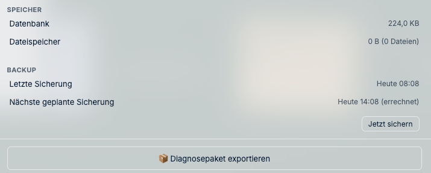

# Betrieb, Sicherung und Update

Dieses Kapitel gibt Ihnen das Nötige in verständlicher Form. Für die genauen technischen Abläufe
gibt es zwei ausführliche Dokumente, auf die jeweils verwiesen wird — deren Besonderheit: **sie
werden bei jedem Testlauf gegen das tatsächliche Programmverhalten geprüft.** Weicht die
Beschreibung ab, schlägt ein Test fehl. Sie können sich also darauf verlassen.

## Wo Ihre Daten liegen

Alles an einer Stelle:

- **Docker:** im Datenträger `j_desk_daten`. Pfad ermitteln mit
  `docker volume inspect <projekt>_j_desk_daten`
- **Direktinstallation:** `/var/lib/j-desk`

Darin: die Datenbank (`desktop.sqlite`), die hochgeladenen Dateien (`files/`) und die
automatischen Sicherungen (`backup/`).

## Sicherung

### Was J-DESK selbst tut

J-DESK legt automatisch Sicherungen im Unterordner `backup/` an — standardmäßig **alle sechs
Stunden**, einstellbar über `BACKUP_INTERVAL_HOURS`. **Das ersetzt keine Datensicherung** —
liegt der Ordner auf derselben Platte, ist er bei einem Plattendefekt genauso verloren wie
das Original.

**Wo Sie den Stand sehen:** In der **Systemdiagnose** (obere Leiste) steht unter *Backup*,
wann zuletzt gesichert wurde und wann die nächste Sicherung fällig ist. Der Knopf **„Jetzt
sichern"** löst eine Sicherung von Hand aus — nützlich vor einem Update.



> **Prüfen Sie diese Zeile regelmäßig.** Liegt die letzte Sicherung länger zurück als der
> eingestellte Takt, läuft etwas nicht — und das merkt man sonst erst, wenn man die
> Sicherung braucht.

### Das Diagnosepaket

Darunter liegt **„Diagnosepaket exportieren"** — eine lesbare Textdatei zum Mitschicken, wenn
Sie eine Störung melden.

**Sie können es bedenkenlos herausgeben.** Das Paket enthält ausschließlich technische
Zustandsangaben: Versionen, ob eine Verbindung steht, Speichergrößen, Sicherungszeitpunkte.
Ausdrücklich **nicht** enthalten sind Mandanteninhalte, Dokumente, Passwörter und
Zugangsdaten — und auch keine Protokolldateien, weil darin Mandantennamen auftauchen könnten.
Selbst die konfigurierten Adressen Ihrer j-lawyer- und Vorschau-Anbindung bleiben draußen; es
steht nur da, ob die Verbindung steht.

Das ist keine Absichtserklärung, sondern im Programm so gebaut und durch Tests abgesichert.

### Was Sie tun müssen

Das Datenverzeichnis muss **auf ein anderes Medium**. Ein Beispiel für eine tägliche Sicherung:

```bash
#!/bin/bash
# /usr/local/bin/j-desk-sichern.sh
ZIEL="/mnt/sicherung/j-desk/$(date +%Y-%m-%d)"
mkdir -p "$ZIEL"

# Wichtig: erst anhalten. Eine Datenbank, die während des Kopierens beschrieben
# wird, kann unbrauchbar werden.
docker compose -f /opt/j-desk/compose.yaml stop
docker run --rm -v j-desk_j_desk_daten:/daten -v "$ZIEL":/ziel alpine \
  tar czf /ziel/j-desk-daten.tar.gz -C /daten .
docker compose -f /opt/j-desk/compose.yaml start
```

Täglich per cron:

```
0 2 * * * /usr/local/bin/j-desk-sichern.sh
```

**Der Punkt, den viele übersehen:** Eine Datenbank, die im laufenden Betrieb kopiert wird, kann
mitten in einem Schreibvorgang erwischt werden — die Kopie ist dann still beschädigt und fällt
erst auf, wenn Sie sie brauchen. Deshalb hält das Beispiel den Dienst kurz an.

### Prüfen, dass die Sicherung etwas taugt

**Eine Sicherung, die nie zurückgespielt wurde, ist keine Sicherung.** Die Datenbank lässt sich
mit einem Befehl prüfen:

```bash
sqlite3 /pfad/zur/sicherung/desktop.sqlite "PRAGMA integrity_check;"
```

Kommt `ok` zurück, ist sie unversehrt. Etwas anderes bedeutet: unbrauchbar — dann muss die
Sicherungsroutine überprüft werden.

Nehmen Sie sich einmal im Quartal die Zeit, eine Sicherung auf einem Testsystem tatsächlich
zurückzuspielen.

→ **Genaues Vorgehen zur Wiederherstellung:**
[docs/deployment/backup-strategy.md](../../deployment/backup-strategy.md)

## Update

Der Ablauf ist immer derselbe:

```bash
# 1. Sichern (siehe oben) — nicht überspringen
/usr/local/bin/j-desk-sichern.sh

# 2. Neue Fassung holen und starten
cd /opt/j-desk
sudo docker compose pull
sudo docker compose up -d

# 3. Nachsehen
sudo docker compose ps          # sollte "healthy" zeigen
sudo docker compose logs --tail=30
```

**Warum vor jedem Update gesichert wird:** Eine neue Fassung kann die Struktur der Datenbank
umstellen. Danach kann eine ältere Fassung damit unter Umständen nichts mehr anfangen. Der Weg
zurück führt dann über die Sicherung — wenn es eine gibt.

Für den Kanzleibetrieb empfehlen wir, in der `.env` eine **feste Version** einzutragen statt
`latest`. Dann entscheiden Sie selbst, wann sich etwas ändert:

```
J_DESK_VERSION=1.0.0
```

→ **Ausführliches Update-Vorgehen samt Prüfschritten:**
[docs/deployment/update-runbook.md](../../deployment/update-runbook.md)

## Laufende Überwachung

Für eine Überwachung genügt diese Adresse:

```
http://<server>:4810/api/v1/auth/status
```

Antwortet sie mit HTTP 200, läuft J-DESK. Antwortet sie nicht, stimmt etwas nicht.

Behalten Sie außerdem den **Platz auf der Platte** im Blick. Hochgeladene Dateien und Sicherungen
wachsen mit der Zeit; eine volle Platte legt den Dienst lahm.

## Berufsrechtliches

Zu Aufbewahrung, Mandatsgeheimnis und den Anforderungen der BRAO an den Betrieb gibt es ein
eigenes Dokument:
[docs/deployment/betriebssicherheit-brao.md](../../deployment/betriebssicherheit-brao.md)

---

**Zurück:** [Installation](01-installation.md) · **Weiter:** [Störungssuche](05-stoerungssuche.md)
