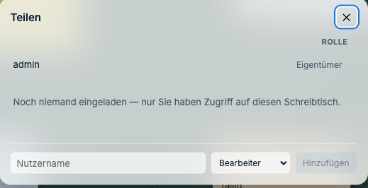
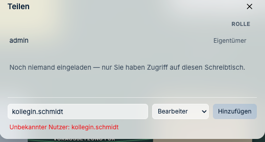
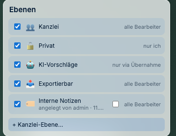
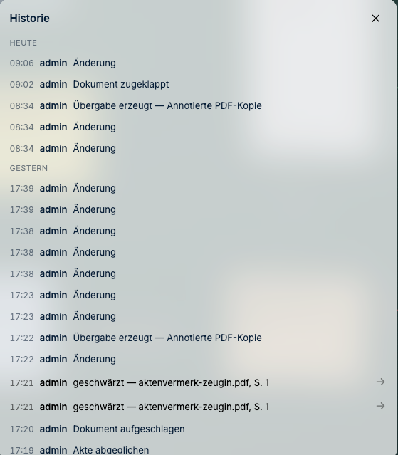
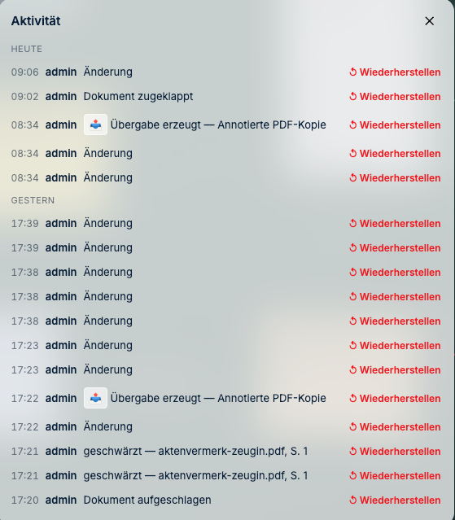

# Benutzer und Rechte

*Wer darf was — und wie Sie das beantworten, wenn jemand fragt.*

---

## Wie lege ich Benutzer an?

**Im j-lawyer-Betrieb: gar nicht.** Das ist der Normalfall und beabsichtigt.

Die Anmeldung läuft gegen j-lawyer, die Zugangsdaten werden dort geprüft. Wer in j-lawyer
ein Konto hat, kann sich an J-DESK anmelden. Es gibt keine zweite Benutzerliste, die
auseinanderlaufen könnte.

Ein Konto sperren Sie folglich in j-lawyer, nicht hier.

**Im eigenständigen Betrieb** verwaltet J-DESK ein eigenes Konto: das der Ersteinrichtung.
Weitere Konten kennt die Oberfläche nicht — es gibt keine Benutzerverwaltung, keinen
Einladungscode und keine Konto-Anlage aus der Anwendung heraus.

> **Der eigenständige Betrieb ist damit ein Einzelplatzbetrieb.** Wer J-DESK zu mehreren
> nutzen will, betreibt ihn an j-lawyer. Das ist keine Einschränkung nebenbei, sondern die
> Entscheidung, keine zweite Benutzerverwaltung zu bauen, die niemand pflegt.

---

## Die fünf Rollen je Schreibtisch

Unabhängig von der Anmeldung hat jeder Nutzer **pro Schreibtisch** eine Rolle. Was die
Rollen dürfen, steht nicht im Ermessen der Oberfläche, sondern in einer festen Tabelle:

| Rolle | Ansehen | Inhalte anlegen und ändern | Export und Hochladen | Ebenen verwalten | Endgültig löschen |
|---|:--:|:--:|:--:|:--:|:--:|
| **Eigentümer** | ✓ | ✓ | ✓ | ✓ | ✓ |
| **Bearbeiter** | ✓ | ✓ | ✓ | ✓ | — |
| **Kommentator** | ✓ | nur kommentieren | — | — | — |
| **Nur-Lesen** | ✓ | — | — | — | — |
| **externer Gast** | eingeschränkt | — | — | — | — |

Die praktisch wichtigste Zeile ist die zweite: **Ein Bearbeiter darf exportieren und in die
Akte hochladen, aber nichts endgültig vernichten.** Das Schreddern und das Leeren des
Papierkorbs bleiben dem Eigentümer vorbehalten.

Der **externe Gast** sieht einen bewusst beschnittenen Ausschnitt — interne Inhalte werden
ihm nicht angezeigt.

**Diese Prüfungen gelten auch für die KI-Anbindung.** Sie läuft über dieselben Wege wie der
Browser und unterliegt denselben Rollenprüfungen; es gibt keinen Nebeneingang.

---

## Wie kommt eine Kollegin an einen Schreibtisch?

Hier liegt das häufigste Missverständnis, und die Antwort hängt an der Betriebsart.

**Im j-lawyer-Betrieb geschieht das von selbst.** Wer eine Akte in j-lawyer sehen darf und
sie in J-DESK öffnet, bekommt den zugehörigen Schreibtisch automatisch als **Bearbeiter**.
Wer die Akte zuerst geöffnet hat, bleibt Eigentümer. Sie müssen dafür nichts vergeben —
die Berechtigung stammt aus j-lawyer, und J-DESK folgt ihr.

Das heißt zugleich: **Nehmen Sie jemandem in j-lawyer die Akte weg, ist auch der
Schreibtisch für ihn zu.** Ein zweiter Ort, an dem Sie das pflegen müssten, existiert nicht.

**So geht's** — wenn Sie eine Rolle von Hand ändern oder jemanden ohne j-lawyer-Zugriff
hinzunehmen wollen: obere Leiste → **„Teilen"**. Der Dialog listet alle Mitglieder mit ihrer
Rolle; die Auswahl wirkt sofort, es gibt keinen Speichern-Knopf.

> **Stolperstein: „Unbekannter Nutzer".** Sie können nur Personen eintragen, die J-DESK
> bereits kennt — und J-DESK lernt eine Person erst kennen, **wenn sie sich mindestens
> einmal selbst angemeldet hat**. Solange Ihre Kollegin das nicht getan hat, weist der
> Dialog ihren Namen zurück, egal wie richtig er geschrieben ist.
>
> 
>
> Die Abhilfe ist unspektakulär: die Person meldet sich einmal an, danach steht sie zur
> Auswahl. Im j-lawyer-Betrieb hat sich die Frage damit meist schon erledigt — mit der
> Anmeldung und dem Öffnen der Akte ist sie ohnehin Bearbeiterin.

**„Entfernen"** neben einer Zeile nimmt den Zugriff sofort weg — auch bei einer offenen
Sitzung: Die Verbindung der betroffenen Person wird getrennt, nicht erst beim nächsten
Anmelden. Der Eigentümer lässt sich nicht entfernen.

---

## Die Ebenen

Quer zu den Rollen liegen **Ebenen**. Jeder Inhalt liegt auf genau einer. Die Ebenen
erreichen Sie über die obere Leiste → **„Ebenen"**:

| Ebene | Wer darf darauf arbeiten |
|---|---|
| **Kanzlei** | alle Bearbeiter |
| **Privat** | nur ich |
| **KI-Vorschläge** | nur über die ausdrückliche Übernahme |
| **Exportierbar** | alle Bearbeiter — und **nur diese Ebene darf in Exporte** |
| eigene Ebenen | alle Bearbeiter |

Das Häkchen links blendet eine Ebene **in Ihrer eigenen Ansicht** ein und aus. Es ist ein
Filter für Ihren Bildschirm, keine Berechtigung — wer etwas sehen darf, entscheidet die
Ebene selbst, nicht Ihr Häkchen.

**So geht's** — eine eigene Ebene anlegen: **„Ebenen" → „+ Kanzlei-Ebene…"**, Namen
eintragen, bestätigen. Eigene Ebenen tragen den Vermerk, wer sie angelegt hat, und
bekommen ein **zweites Häkchen: die Exportfreigabe.**

> **Die Voreinstellung ist fail-closed:** Eine neue Ebene ist **nicht** für den Export
> freigegeben — das Häkchen ist leer. Was nicht ausdrücklich freigegeben ist, gilt als
> intern. Ein Irrtum in Export-Richtung kostet Vertraulichkeit, ein Irrtum in die andere
> Richtung nur eine fehlende Seite.

Umschalten lässt sich die Exportfreigabe nur bei **selbst angelegten** Ebenen. Die vier
mitgelieferten Ebenen haben ihre Freigabe fest — *Exportierbar* darf hinaus, die anderen
drei nicht. Das ist Absicht: Sonst wäre die Zusage „interne Notizen bleiben drin" eine
Einstellung, die jemand versehentlich umlegt.

Ebenen anlegen und ihre Freigabe ändern dürfen Eigentümer und Bearbeiter.

---

## Warum sieht jemand etwas nicht?

Die Frage kommt garantiert. Sie ist **ohne Datenbankzugriff** beantwortbar.

**So geht's** — zwei Wege in dieselbe Auskunft:

- obere Leiste → **„🛡 Admin"** — dann wählen Sie Person und Objekt selbst aus
- **Rechtsklick auf die Karte → „Sichtbarkeit prüfen…"** — dann ist das Objekt schon gesetzt

Beides steht nur dem Eigentümer des Schreibtischs offen. J-DESK zeigt, was die Person sieht
— **und warum**.

Solange der Schreibtisch nur Ihnen gehört, gibt es niemanden zu prüfen — dann steht das
so da.

Die drei üblichen Ursachen:

1. **In j-lawyer** fehlt die Berechtigung für das Quelldokument. Dann muss sie dort erteilt
   werden — J-DESK kann sie nicht überschreiben
2. **Die Ebene** ist für die Person nicht sichtbar (etwa die private Ebene einer Kollegin)
3. **Die Rolle** auf diesem Schreibtisch reicht nicht

---

## Wie sicher ist das technisch?

Die Prüfung findet **auf dem Server** statt, nicht in der Oberfläche.

Das ist ein wichtiger Unterschied: Ein ausgeblendeter Knopf ist keine Sicherung — wer die
Schnittstelle direkt anspricht, käme an die Daten. In J-DESK **liefert der Server die
Inhalte gar nicht erst aus**, wenn der Empfänger sie nicht sehen darf. Für alle Wege
gleichermaßen: Web-Schnittstelle, Echtzeitverbindung, Export, Suche, KI-Anbindung.

Belegt ist das durch einen Test, der den tatsächlichen Netzwerkverkehr mitschneidet und
prüft, dass unerlaubte Inhalte nicht einmal übertragen werden.

---

## Was steht in der Historie?

Jede Änderung wird protokolliert: wer, was, wann. Für die Frage, was wann an wen herausging,
ist das die belastbare Auskunft — nicht die Erinnerung der Beteiligten.

Es gibt **zwei Ansichten auf dasselbe Protokoll**, und für Ihre Arbeit ist der Unterschied
wichtig:

**Die Historie** (obere Leiste → **„Historie"**) ist die lesende Ansicht. Exporte stehen
dort als *„Übergabe erzeugt"* mit dem Format, Schwärzungen mit Dokument und Seite. Der Pfeil
am Zeilenende springt zur betroffenen Stelle.

**Die Aktivität** (Schreibtisch-Menü oben links → **„🕘 Aktivität…"**) ist die prüfende
Ansicht. Sie kennt keine Sprungziele und zeigt keine Dokumentinhalte, dafür trägt jede
besondere Zeile vor dem Text ein Symbol — 📤 für eine Übergabe, 🤖 für eine KI-Übernahme,
↺ für eine Wiederherstellung.

**Halten Sie den Mauszeiger auf das Symbol.** Dort steht, was die Zeile selbst nicht
wiederholt: bei einer KI-Übernahme der Name des KI-Zugangs, von dem die Anregung stammt.
Wer sie freigegeben hat, steht ohnehin am Zeilenanfang — es ist die Person, die dort als
Handelnde geführt wird.

Jede Zeile trägt hier außerdem **„Wiederherstellen"**. Achten Sie auf die Tragweite: Das
setzt **den ganzen Schreibtisch** auf den Stand dieses Zeitpunkts zurück — es nimmt nicht
nur diesen einen Schritt heraus. Alles, was danach geschah, ist damit weg. J-DESK fragt
vorher nach, sichert den aktuellen Stand automatisch weg und sagt beides im Bestätigungs-
fenster deutlich; verbundene Kolleginnen sehen die Änderung sofort.

Die einzige Ausnahme sind übernommene KI-Anregungen: Bei ihnen steht statt dessen
**„Zurücknehmen"**, und das betrifft tatsächlich nur diesen einen Vorgang samt der dabei
entstandenen Objekte.

Beides dürfen Eigentümer und Bearbeiter.

> **Was die Historie nicht leistet:** Die meisten Zeilen heißen schlicht *„Änderung"*. Sie
> beantwortet zuverlässig **wer wann etwas getan hat** und benennt die heiklen Vorgänge —
> Übergabe, Schwärzung, KI-Übernahme, Wiederherstellung — ausdrücklich. Ein Wortprotokoll
> jeder einzelnen Verschiebung ist sie nicht.

---

## Was ist mit Löschen?

Drei Stufen, bewusst getrennt:

| Stufe | Wirkung | Umkehrbar | Wer darf |
|---|---|---|---|
| vom Tisch entfernen | verschwindet vom Schreibtisch | ja | Bearbeiter aufwärts |
| in den Papierkorb | liegt im Papierkorb | ja | Bearbeiter aufwärts |
| schreddern | endgültig weg | **nein** | **nur der Eigentümer** |

**In j-lawyer wird dabei nie etwas gelöscht.** Diese Zusage sollten Sie der Kanzlei
gegenüber deutlich machen — sie nimmt die größte Sorge beim Einstieg.

---

**Weiter:** [Störungssuche](05-stoerungssuche.md) ·
*Zurück zur [Schnellhilfe](README.md)*
