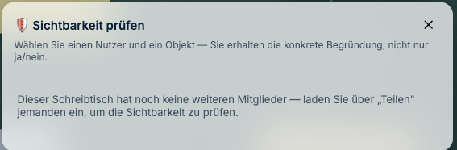

# Benutzer und Rechte

*Wer darf was — und wie Sie das beantworten, wenn jemand fragt.*

---

## Wie lege ich Benutzer an?

**Im j-lawyer-Betrieb: gar nicht.** Das ist der Normalfall und beabsichtigt.

Die Anmeldung läuft gegen j-lawyer, die Zugangsdaten werden dort geprüft. Wer in j-lawyer
ein Konto hat, kann sich an J-DESK anmelden. Es gibt keine zweite Benutzerliste, die
auseinanderlaufen könnte.

Ein Konto sperren Sie folglich in j-lawyer, nicht hier.

**Im eigenständigen Betrieb** verwaltet J-DESK eigene Konten. Das erste entsteht über die
Ersteinrichtungsmaske und hat Verwaltungsrechte; weitere werden aus der Anwendung heraus
angelegt.

---

## Die fünf Rollen je Schreibtisch

Unabhängig von der Anmeldung hat jeder Nutzer **pro Schreibtisch** eine Rolle:

| Rolle | Darf |
|---|---|
| **Eigentümer** | alles, einschließlich Freigaben und endgültigem Löschen |
| **Bearbeiter** | Inhalte anlegen, ändern, verknüpfen |
| **Kommentator** | kommentieren, aber den Bestand nicht umbauen |
| **Nur-Lesen** | ansehen |
| **externer Gast** | eingeschränkter Blick — sieht **keine internen Inhalte** |

**Gefährliche Handlungen sind rollengebunden**: endgültiges Löschen, Export und Hochladen.
Das gilt auch für Zugriffe über die KI-Anbindung — dort greifen dieselben Prüfungen wie im
Browser, es gibt keinen Nebeneingang.

---

## Die Ebenen

Quer zu den Rollen liegen **Ebenen**. Jeder Inhalt liegt auf einer:

| Ebene | Sichtbar für |
|---|---|
| **privat** | nur den Ersteller |
| **kanzlei** | alle Bearbeiter |
| **ki-vorschlaege** | erst nach ausdrücklicher Übernahme |
| **exportierbar** | alle Bearbeiter, **und darf in Exporte** |
| eigene Ebenen | wie eingerichtet |

Jede Ebene hat eine eigene Bearbeitungsberechtigung und eine eigene Exportfreigabe.

**Die Voreinstellung ist fail-closed:** Was nicht ausdrücklich für den Export freigegeben
ist, gilt als intern. Ein Irrtum in Export-Richtung kostet Vertraulichkeit, ein Irrtum in
die andere Richtung nur eine fehlende Seite.

---

## Warum sieht jemand etwas nicht?

Die Frage kommt garantiert. Sie ist **ohne SQL** beantwortbar.

**Rechtsklick auf die betreffende Karte → „Sichtbarkeit prüfen…"** (für Eigentümer des
Schreibtischs). Wählen Sie die Person aus, und J-DESK zeigt, was sie sieht — **und warum**.

Solange der Schreibtisch nur Ihnen gehört, gibt es niemanden zu prüfen — dann steht das
so da. Laden Sie über **„Teilen"** jemanden ein, und die Prüfung wird nutzbar.

Die drei üblichen Ursachen:

1. **In j-lawyer** fehlt die Berechtigung für das Quelldokument. Dann muss sie dort erteilt
   werden — J-DESK kann sie nicht überschreiben
2. **Die Ebene** ist für die Person nicht sichtbar (etwa die private Ebene einer Kollegin)
3. **Die Rolle** auf diesem Schreibtisch reicht nicht

---

## Wie sicher ist das technisch?

Die Prüfung findet **auf dem Server** statt, nicht in der Oberfläche.

Das ist ein wichtiger Unterschied: Ein ausgeblendeter Knopf ist keine Sicherung — wer die
Schnittstelle direkt anspricht, käme an die Daten. In J-DESK **liefert der Server die
Inhalte gar nicht erst aus**, wenn der Empfänger sie nicht sehen darf. Für alle Wege
gleichermaßen: Web-Schnittstelle, Echtzeitverbindung, Export, Suche, KI-Anbindung.

Belegt ist das durch einen Test, der den tatsächlichen Netzwerkverkehr mitschneidet und
prüft, dass unerlaubte Inhalte nicht einmal übertragen werden.

---

## Was steht in der Historie?

Jede Änderung wird protokolliert: wer, was, wann. Einschließlich **Exporten** (mit
Auslöser) und **KI-Aktionen** (mit Genehmiger).

Bei der Frage, was wann an wen herausging, ist das die belastbare Auskunft — nicht die
Erinnerung der Beteiligten.

---

## Was ist mit Löschen?

Drei Stufen, bewusst getrennt:

| Stufe | Wirkung | Umkehrbar |
|---|---|---|
| vom Tisch entfernen | verschwindet vom Schreibtisch | ja |
| in den Papierkorb | liegt im Papierkorb | ja |
| schreddern | endgültig weg | **nein** |

**In j-lawyer wird dabei nie etwas gelöscht.** Diese Zusage sollten Sie der Kanzlei
gegenüber deutlich machen — sie nimmt die größte Sorge beim Einstieg.

---

**Weiter:** [Störungssuche](05-stoerungssuche.md) ·
*Zurück zur [Schnellhilfe](README.md)*
