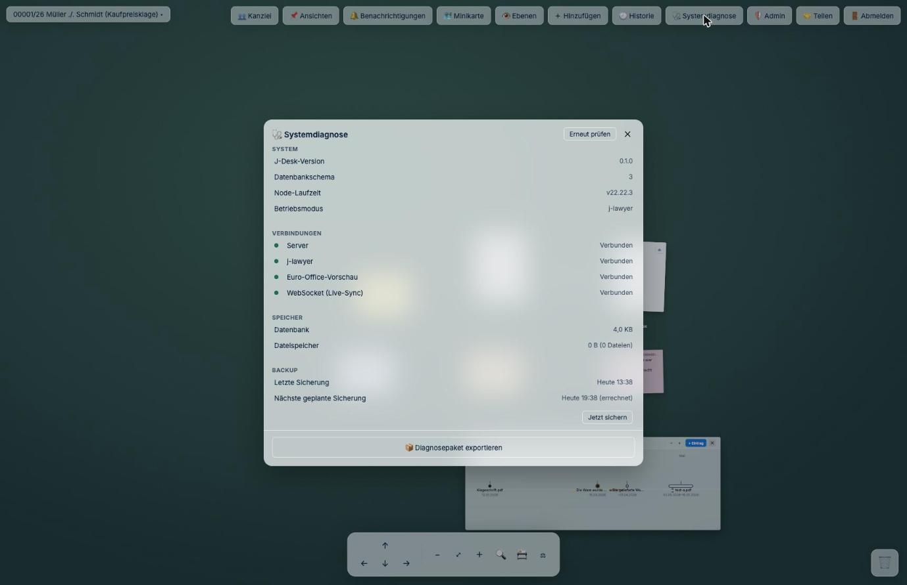

# Störungssuche

Die Fälle hier sind nicht ausgedacht — es sind die, die beim Aufbau und Betrieb tatsächlich
aufgetreten sind.

## Zuerst: die drei Befehle, die fast alles zeigen

```bash
sudo docker compose ps            # Läuft es? Ist es gesund?
sudo docker compose logs --tail=50 # Was sagt es?
curl -s http://localhost:4810/api/v1/auth/status   # Antwortet es?
```

Bei der Direktinstallation entsprechend:

```bash
systemctl status j-desk
journalctl -u j-desk -n 50 --no-pager
```

Die letzte Abfrage ist besonders nützlich, weil sie Ihnen zugleich die Betriebsart verrät:

```json
{"needsSetup":false,"mode":"jlawyer","needsModeChoice":false}
```

`"mode":"jlawyer"` heißt: die Anbindung ist aktiv. `"mode":"standalone"` heißt: J-DESK arbeitet
eigenständig — wenn Sie das nicht wollten, ist `JLAWYER_URL` nicht angekommen.

---

## Der Container startet immer wieder neu

**Erkennungszeichen:** `docker compose ps` zeigt `restarting`, der Zähler `RestartCount` steigt.

```bash
sudo docker compose logs --tail=30
```

**Fall: `ERR_MODULE_NOT_FOUND: Cannot find package '…'`**

Im Abbild fehlt ein Programmpaket. Wenn Sie ein offizielles Abbild verwenden, ist das ein Fehler
unsererseits — bitte [melden](https://github.com/PBaumfalk/j-desk/issues) und vorübergehend auf
die vorherige Version zurückgehen (in der `.env` `J_DESK_VERSION` auf die letzte funktionierende
Nummer setzen, dann `docker compose up -d`).

Bauen Sie das Abbild selbst, prüfen Sie, ob das fehlende Paket in
`packages/server/package.json` steht — Pakete, die nur in der obersten `package.json` stehen,
landen nicht im Abbild.

**Fall: Fehlercode 137**

Das Betriebssystem hat den Container wegen Speichermangels abgeschossen. Betrifft fast immer die
Office-Vorschau (`eurooffice`), die 4 GB für sich braucht. Entweder Speicher aufstocken oder den
Dienst abschalten — J-DESK läuft ohne ihn vollständig.

---

## „Anmeldung fehlgeschlagen", obwohl die Zugangsdaten stimmen

Fast immer erreicht J-DESK das j-lawyer nicht. Prüfen Sie **vom Container aus**, nicht vom
Server:

```bash
sudo docker compose exec j-desk node -e "fetch(process.env.JLAWYER_URL+'/v1/cases/list').then(r=>console.log('Antwort:',r.status)).catch(e=>console.log('Kein Kontakt:',e.message))"
```

- **`Antwort: 401`** — bestens. Die Verbindung steht, 401 heißt nur „ohne Anmeldung nicht
  erlaubt". Liegt der Fehler dann woanders, prüfen Sie das Konto in j-lawyer selbst.
- **`Kein Kontakt: …`** — die Adresse stimmt nicht. Die drei üblichen Ursachen:

| Fehler | Richtig |
|---|---|
| `http://localhost:8080/j-lawyer-io` | `http://host.docker.internal:8080/j-lawyer-io` — für den Container ist `localhost` er selbst |
| `http://kanzlei-server:8080` | `http://kanzlei-server:8080/j-lawyer-io` — der Pfad am Ende fehlt |
| Port von J-DESK eingetragen | Es muss der Port von **j-lawyer** sein |

Nach jeder Änderung an der `.env`:

```bash
sudo docker compose up -d
```

(Ein bloßes `restart` liest die `.env` nicht neu.)

---

## Die Seite bleibt weiß / „Nicht erreichbar"

1. **Läuft der Dienst?** `docker compose ps`
2. **Richtiger Port?** Steht in der `.env` unter `J_DESK_PORT`.
3. **Firewall?** Vom Server selbst prüfen:
   ```bash
   curl -s -o /dev/null -w "%{http_code}\n" http://localhost:4810/api/v1/auth/status
   ```
   Kommt hier `200`, läuft J-DESK und das Problem liegt im Netz zwischen Arbeitsplatz und Server
   — dann Firewall-Regeln für Port 4810 prüfen.

---

## Word- und Excel-Dateien werden nicht angezeigt

Erwartetes Verhalten, wenn die Office-Vorschau nicht eingerichtet ist — die Dateien werden dann
zum Herunterladen angeboten. Einrichtung siehe [Installation](01-installation.md).

Ist sie eingerichtet und es klappt trotzdem nicht, ist meist eine der beiden Richtungen gestört:

- **J-DESK erreicht den Vorschaudienst nicht** → `EUROOFFICE_URL` prüfen.
- **Der Vorschaudienst erreicht J-DESK nicht** → `PUBLIC_URL` prüfen. Der Dienst muss die Datei
  bei J-DESK abholen; steht dort `localhost`, sucht er sie bei sich selbst.
- **Geheimnis stimmt nicht überein** → `EUROOFFICE_JWT_SECRET` muss in `.env` und `compose.yaml`
  Zeichen für Zeichen gleich sein.

---

## Nach einem Update geht etwas nicht mehr

Zurück auf die vorherige Version: in der `.env` die feste Nummer eintragen, dann neu starten.

```bash
J_DESK_VERSION=1.0.0
```

```bash
sudo docker compose up -d
```

Die Daten bleiben dabei unangetastet — sie liegen im Datenträger, nicht im Abbild. **Ausnahme:**
Hat die neue Fassung die Datenbank umgestellt, kann eine ältere Fassung damit unter Umständen
nichts anfangen. Deshalb: [vor jedem Update sichern](03-betrieb-und-sicherung.md).

---

## Wenn nichts davon hilft

J-DESK bringt eine **Systemdiagnose** mit (im Menü erreichbar). Sie zeigt Versionen,
Verbindungszustände und bekannte Probleme und lässt sich als Paket exportieren.



Das ist die erste Seite, die Sie bei einer Störungsmeldung aufrufen sollten: Sie beantwortet
auf einen Blick, ob Server, j-lawyer, Vorschaudienst und Live-Verbindung stehen — und wann
zuletzt gesichert wurde.

Für eine [Fehlermeldung](https://github.com/PBaumfalk/j-desk/issues) hilfreich:

- Ausgabe von `docker compose ps` und den letzten 50 Protokollzeilen
- Antwort von `/api/v1/auth/status`
- Betriebsart (mit j-lawyer oder eigenständig) und Installationsweg

**Bitte vorher durchsehen:** In Protokollen können Aktenzeichen und Dateinamen stehen. Die gehören
nicht in ein öffentliches Issue.

---

**Zurück:** [Installation](01-installation.md) · [Betrieb und Sicherung](03-betrieb-und-sicherung.md)
